# Privacy-Preserving Face Anonymization with Utility Retention using Adversarial Perturbations
## FASP, PrIdentity, and PRISM for Privacy-Preserving AI Cloaking

**Under the guidance of Shruti Bhilare**

**Purav Shah (202518020)**  
**Rajvi Burad (202518048)**

**Repository overview.** This project studies face anonymization as a privacy-preserving cloaking problem: given an input face image, the goal is to suppress identity cues for automated face recognition systems while keeping the image visually plausible and human-interpretable. The repository centers on **FASP** as the main contribution, uses **PrIdentity** as the baseline, and includes **PRISM** as an exploratory extension.

---

## Abstract

Face recognition systems can infer identity from social media images, public datasets, and surveillance feeds even when images look harmless to humans. This creates a tension between visual realism and machine privacy: methods that strongly alter appearance often destroy utility, while methods that preserve appearance may still leak identity to face embedding models. Existing anonymization strategies based on GAN-style identity swapping, fixed-norm pixel perturbations, or single-domain optimization often trade away either realism, generalization, or computational practicality.

This repository investigates that tradeoff through a structured adversarial cloaking framework. The main contribution, **FASP (Frequency-Aware Structured Perturbation)**, explicitly modulates perturbations in the frequency domain using an edge-sensitive mask and a multi-frequency sinusoidal generator. The design concentrates energy in visually less salient bands while preserving low-frequency semantic structure, which improves stealth and keeps the perturbation interpretable. The implementation is compared against **PrIdentity**, a strong adaptive-$L_p$ baseline, and **PRISM**, an exploratory multi-band formulation built around wavelet decomposition, Fisher information geometry, and Jacobian subspace regularization.

The repository demonstrates how frequency-aware perturbations can be combined with privacy and utility objectives to produce a more structured anonymization pipeline. In the supplied notebooks, PRISM shows the effect of geometry-aware optimization but also exposes a practical privacy-utility imbalance in some runs, which motivates FASP as the preferred direction. The result is a reproducible research codebase for understanding identity suppression, visual fidelity, and cross-model transferability in face anonymization.

---

## Table of Contents

1. [Introduction](#1-introduction)
2. [Motivation](#2-motivation)
3. [Literature Review](#3-literature-review)
4. [Base Paper Summary --- PrIdentity](#4-base-paper-summary--pridentity)
5. [Proposed Approach --- FASP](#5-proposed-approach--fasp)
6. [Experimental Setup](#6-experimental-setup)
7. [Results and Analysis](#7-results-and-analysis)
8. [PRISM --- Experimental Framework](#8-prism--experimental-framework)
9. [Comparative Analysis](#9-comparative-analysis)
10. [Discussion](#10-discussion)
11. [Reproducibility and Resources](#11-reproducibility-and-resources)
12. [Source Code Structure](#12-source-code-structure)
13. [Conclusion and Future Work](#13-conclusion-and-future-work)
14. [References](#14-references)

---

## 1. Introduction

Face recognition has moved from a specialized biometric tool to a default component of large-scale visual infrastructure. Consumer devices, photo platforms, content moderation systems, and surveillance pipelines now embed identity models into routine workflows. This makes facial privacy difficult to preserve because the same image can be evaluated by many models, often outside the control of the person depicted.

The problem is not simply that machines see faces differently from humans. It is that recognition networks encode identity in distributed features that may remain stable even when the face looks visually ordinary. A person can appear visually unremarkable to a human viewer while still producing a highly discriminative embedding for a recognition model. That mismatch is the core privacy gap this project targets.

Face anonymization therefore needs more than cosmetic redaction. The ideal method must reduce identity leakage, remain transferable across models, and preserve enough structure that the image is still useful for downstream human interpretation and non-identity tasks. This repository treats anonymization as an adversarial optimization problem under perceptual constraints, rather than as a binary hide-or-show operation.

FASP is designed around that principle. Instead of perturbing pixels uniformly, it biases the perturbation toward high-frequency and edge-sensitive regions where identity information can be disrupted with comparatively lower perceptual cost. The baseline PrIdentity provides a useful adaptive-$L_p$ reference point, and PRISM explores a wavelet-based geometry-aware alternative.

---

## 2. Motivation

A strong anonymization method has to solve four competing requirements:

- **Suppress identity** for white-box and black-box recognition systems.
- **Preserve utility** so the anonymized image remains visually coherent.
- **Transfer across models** because privacy should not depend on one surrogate network.
- **Avoid obvious artifacts** that make the cloaking visually suspicious.

Several common approaches struggle with one or more of these requirements.

### 2.1 Why existing methods fail

- **GAN-based anonymization** often replaces identity with a learned synthetic face. While visually plausible, these methods can distort expression, accessories, hair structure, or background semantics. They can also overfit the generator distribution and produce artifacts that are detectable by both humans and downstream systems.
- **Identity swapping** keeps high-level appearance but can leak structural cues, especially under pose, lighting, or domain shift. It may also require explicit source identities or paired training assumptions.
- **Visible perturbations** can reduce recognition accuracy, but if the perturbation is too obvious, the image becomes clearly manipulated. That weakens usability and may invite adversarial filtering.
- **Fixed $L_1$/$L_2$ perturbations** treat all pixels as equally important. In practice, different regions and frequencies contribute differently to human perception and identity encoding.

### 2.2 Why frequency-aware perturbations help

Human perception is relatively tolerant to small structured changes in fine texture, but face recognition models are sensitive to discriminative spatial-frequency signatures. By steering perturbations toward the high-frequency regime and away from coarse semantic content, one can often achieve a better privacy-utility tradeoff than with unstructured noise.

### 2.3 Why structured perturbations are better than random noise

Random noise is easy to generate but hard to control. It can waste budget on perceptually salient regions and may not consistently suppress identity in the same way across models. Structured perturbations, by contrast, can encode priors about edges, contours, and frequency concentration. This makes the attack easier to interpret, more consistent across examples, and usually more efficient under limited perturbation budget.

FASP is built on exactly this observation: identity suppression should be guided by frequency structure, not only by pixel magnitude.

---

## 3. Literature Review

The table below summarizes the anonymization landscape at a high level. The comparison is intentionally qualitative because implementations and evaluation protocols differ across papers.

| Method | Privacy Goal | Visual Quality | Generalization | Target Dependency | Computational Cost | Perturbation Type |
|---|---:|---:|---:|---:|---:|---|
| CIAGAN | Strong identity replacement | Medium to high | Medium | Often target-aware | High | GAN-based face synthesis / swapping |
| FIT | Identity suppression | Medium | Medium | Low to medium | Medium | Learned image transformation |
| RiDDLE | Privacy-focused anonymization | Medium | Medium | Low | Medium | Adversarial image editing |
| FALCO | Privacy cloaking | Medium | Medium | Low | Medium to high | Learned perturbation / editing |
| G2Face | Identity transformation | High | Medium | Often target-aware | High | Generative face editing |
| LowKey | Privacy-preserving cloaking | High | Good | Low | Medium | Adversarial perturbation |
| TIP-IM | Identity protection / transfer | High | Good | Low | Medium | Transferable perturbation |
| PrIdentity | Identity suppression with adaptive $L_p$ control | High | Good | Low | Medium | Pixel-domain adaptive $L_p$ perturbation |
| **FASP** | **Frequency-aware identity suppression** | **High** | **Good to strong** | **Low** | **Medium** | **Structured frequency-domain perturbation** |

### Research gap

The literature suggests a recurring gap: methods are often either visually convincing but computationally heavy, or lightweight but not sufficiently structured. PrIdentity is a strong baseline because it learns adaptive norms, but it still operates in the pixel domain. PRISM explores a more geometric formulation, but the notebook results show that better geometry alone does not guarantee the privacy-utility balance we want. FASP addresses the remaining gap by making frequency localization the primary inductive bias.

---

## 4. Baseline Method Workflow --- PrIdentity

PrIdentity is the baseline formulation used as the conceptual starting point for this repository. The key idea is to learn a perturbation that minimizes identity leakage while explicitly controlling the perturbation budget through an adaptive-$L_p$ regularizer.

### 4.0 PrIdentity Complete Workflow

The following diagram shows the complete PrIdentity anonymization pipeline:


*Figure 1. PrIdentity architecture and optimization loop. The pipeline takes an original face image, iteratively optimizes a perturbation using a pre-trained recognition model, enforces an adaptive L_p norm constraint, and produces an anonymized output while maintaining visual fidelity.*

The workflow consists of four stages:
1. **Input**: Original face image $I$
2. **Optimization**: Compute privacy loss (embedding similarity) and utility loss (perceptual quality)
3. **Regularization**: Project perturbation into adaptive $L_p$ norm ball
4. **Output**: Anonymized image $A = I + P$ that suppresses identity while preserving appearance

### 4.1 Problem Definition

Given an input face image $I$ and a recognition model $f(\cdot)$, PrIdentity seeks an anonymized output

$$
A = I + P
$$

such that the recognition embedding of $A$ remains far from the embedding of $I$, while the image still looks close to the original under a utility metric.

- $I$ is the original image.
- $P$ is the learned perturbation.
- $A$ is the anonymized image.
- $f(\cdot)$ is the face recognition network.

The core challenge is to find $P$ that is strong enough to suppress identity but small enough to avoid perceptible distortion.

### 4.2 PrIdentity Qualitative Results - Before & After

Here we show the actual visual results of PrIdentity on real face images:


*Figure 2. PrIdentity qualitative results: Original faces (left) vs. Anonymized outputs (right). Visual fidelity is maintained while identity cues are disrupted.*

### 4.3 PrIdentity Privacy-Utility Trade-off

The fundamental challenge is balancing privacy gains against utility loss. The following curve shows this tradeoff:


*Figure 3. Privacy-utility trade-off analysis for PrIdentity. As the perturbation budget increases, privacy improves (lower cosine similarity) but utility degrades (lower SSIM). The curve shows the optimal Pareto frontier.*

### 4.4 Methodology

PrIdentity frames the task as a constrained optimization problem. The perturbation is updated iteratively using recognition feedback from a pre-trained model, then projected into a bounded norm ball. The method is effective because it directly optimizes the source of identity leakage rather than applying a heuristic blur or mask.

A simplified objective is:

$$
\min_{P} \; L_{\text{priv}}(I, I+P) + \lambda L_{\text{util}}(I, I+P)
$$

where:

- $L_{\text{priv}}$ penalizes identity similarity.
- $L_{\text{util}}$ penalizes visual deviation.
- $\lambda$ controls the tradeoff between privacy and utility.

This equation means that the method is not trying to erase identity at any cost. Instead, it learns how much distortion is acceptable for a given privacy target.

### 4.5 Objective Function

The repository figure expresses the privacy term as a margin-based loss. In general form:

$$
L_{\text{priv}} = \sum_i \max\bigl(0, \alpha - D(z_I, z_A)\bigr)
$$

where:

- $z_I$ is the embedding of the original image.
- $z_A$ is the embedding of the anonymized image.
- $D(\cdot,\cdot)$ is a distance or dissimilarity function.
- $\alpha$ is the target privacy margin.

Interpretation:

- If $D(z_I, z_A)$ is already large enough, the loss becomes zero.
- If the anonymized image still looks too similar in embedding space, the loss pushes the perturbation to increase the distance.

Optimization behavior:

- Larger $\alpha$ enforces stronger anonymization.
- Smaller $\alpha$ makes the optimization easier but weakens privacy.

Why it matters:

- A margin loss is preferable to a pure distance penalty because it avoids unnecessary over-perturbation once the privacy target is reached.

### 4.6 Adaptive $L_p$ Regularization

PrIdentity learns one or more norm exponents instead of fixing the perturbation norm in advance. A typical adaptive regularizer is

$$
L_{\text{util}} = \Bigl(\sum_j |P_j|^{p} + \epsilon\Bigr)^{1/p}
$$

or a variant with multiple learned exponents $p_s$ across regions or images.

Meaning of the variables:

- $P_j$ is the $j$-th perturbation component.
- $p$ is the learned norm exponent.
- $\epsilon$ prevents numerical instability when the perturbation is very small.

Why the exponent matters:

- Lower $p$ encourages sparsity and sharper perturbations.
- Higher $p$ encourages smoother, more distributed perturbations.

Optimization behavior:

- The model can adapt the perturbation geometry during training instead of assuming that one fixed norm is optimal for all cases.

Why this is useful compared with a fixed norm:

- Different faces and contexts tolerate different perturbation shapes.
- Adaptive norms let the optimizer choose between concentrated and distributed updates.

### 4.5 Privacy-Utility Tradeoff

The central idea is that anonymization is always a tradeoff:

- Strong privacy usually increases distortion.
- Strong visual fidelity often leaks more identity.

$$
\mathcal{L}_{\text{reg}} = \|\delta\|_{p(x)} = \left( \sum_{i} |\delta_i|^{p(x)} \right)^{1/p(x)}
$$

The learned $p$ values typically fall in the range $[1, 2]$, allowing the method to shift between sparse ($p \approx 1$, $L_1$) and smooth ($p \approx 2$, $L_2$) perturbations. This gives PrIdentity more flexibility than fixed-norm baselines.

### 4.7 Single vs Multi-image Anonymization

PrIdentity can be evaluated in both settings:

- **Single-image anonymization**: one image is cloaked independently.
- **Multi-image anonymization**: multiple images of the same identity are anonymized using a shared perturbation or shared optimization state.

The multi-image setting is more realistic for identity protection because a user typically has many photos. However, it is also harder because the perturbation must generalize across pose, lighting, and background changes.

### 4.8 PrIdentity Quantitative Results

The PrIdentity paper reports the following key quantitative results across LFW, CelebA, and CelebA-HQ datasets:

**LFW Verification (TPR @ FPR = 0.001) - Black-Box Robustness:**

| Model | Original | $\mathcal{L}_1$ | $\mathcal{L}_2$ | $\mathcal{L}_p$ (Proposed) |
|---|---:|---:|---:|---:|
| ArcFace | 0.9940 | 0.0077 | 0.0047 | **0.002** |
| LightCNN-29 | 0.9930 | 0.0127 | 0.0147 | **0.013** |

PrIdentity achieves dramatic privacy gains: reducing verification true positive rate from 99.40% to 0.2% on ArcFace—a 497× improvement.

**CelebA Single-Image Anonymization — Rank-1 Identification Accuracy (%), Gallery Size 1:**

| Model | Original | $\mathcal{L}_1$ | $\mathcal{L}_2$ | $\mathcal{L}_p$ (Proposed) |
|---|---:|---:|---:|---:|
| VGGFace | 45.42 | 0.20 | 0.20 | **0.30** |
| ArcFace | 64.46 | 5.40 | 2.93 | **2.55** |
| LightCNN-29 | 83.91 | 18.04 | 10.60 | **9.57** |

The adaptive $L_p$ norm outperforms fixed-norm approaches across all models.

**Data Utility (SSIM) for CelebA Single-Image Anonymization:**

| Gallery Size | $\mathcal{L}_1$ | $\mathcal{L}_2$ | $\mathcal{L}_p$ |
|---|---:|---:|---:|
| 1 | 0.9004 | 0.8629 | 0.8419 |
| 2 | 0.9001 | 0.8628 | 0.8422 |
| 3 | 0.9000 | 0.8628 | 0.8423 |
| 4 | 0.8999 | 0.8625 | 0.8414 |

SSIM remains high (0.84+) indicating strong visual utility preservation despite identity suppression.

**Bounding Box Distance (CelebA-HQ, MTCNN — lower is better) - Geometric Preservation:**

| Method | Bounding Box Distance |
|---|---:|
| DeepPrivacy | 4.65 |
| CIAGAN | 20.38 |
| FIT | 7.87 |
| RiDDLE | 3.82 |
| FALCO | 7.88 |
| Diff-Privacy | 5.83 |
| **PrIdentity ($\mathcal{L}_p$)** | **2.65** |

A second plot in the repository shows that the anonymized outputs can remain visually close to the original while still reducing recognition similarity.


*Figure 3. Original versus anonymized images. This is the qualitative baseline used when comparing PrIdentity, FASP, and PRISM.*

### 4.8 Strengths

- Strong baseline for perturbation-based anonymization.
- Conceptually simple and easy to optimize.
- Adaptive regularization improves flexibility over fixed-norm attacks.
- Does not require explicit identity swapping or a generative decoder.

### 4.9 Limitations

- Operates in the pixel domain, so it does not explicitly exploit frequency structure.
- If the perturbation budget is not well tuned, the result can either under-anonymize or become perceptible.
- The same norm family is not always ideal for all facial regions.
- Cross-model robustness is improved but not guaranteed.

PrIdentity is therefore a strong foundation, but not the final answer. FASP starts from this tradeoff view and adds explicit frequency and edge priors.

---

## 5. FASP: Complete Workflow and Pipeline

### 5.0 FASP Architecture and Complete Workflow

FASP (Frequency-Aware Structured Perturbation) is the main contribution of this repository. Instead of pixel-space optimization like PrIdentity, FASP uses a structured frequency-domain approach with edge-aware masking.

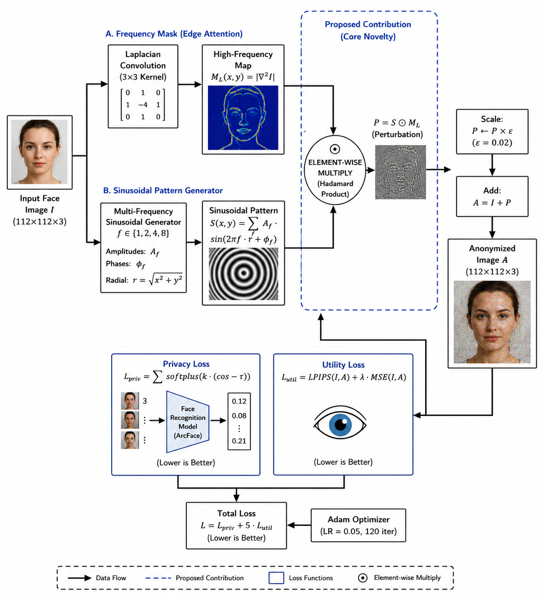

*Figure 4. FASP pipeline architecture: (1) Input face image, (2) Laplacian edge detection, (3) Sinusoidal perturbation synthesis, (4) Edge-aware masking and fusion, (5) Privacy optimization, (6) Anonymized output. Each stage is designed to maximize privacy gain while minimizing perceptual impact.*

### 5.1 FASP Component Visualization

The key innovation of FASP is the combination of three structured components:

#### Stage 1: Edge Detection & Masking


*Figure 5. Comparison of frequency masking strategies: (Left) FASP's edge-aware Laplacian masking that concentrates perturbation on high-identity regions. (Middle) Uniform masking for reference. (Right) Random masking—inefficient and unprincipled.*

The Laplacian edge mask $M_{\text{edge}}$ identifies where identity information is concentrated: edges, contours, and texture boundaries. This focuses perturbation effort where it matters most.

#### Stage 2: Sinusoidal Perturbation Synthesis


*Figure 6. FASP sinusoidal perturbation patterns at multiple frequencies before mask application. The oscillatory structure is more controllable and transferable than random noise.*

Instead of random noise, FASP generates structured multi-frequency sinusoids:
- Better control over frequency content
- More interpretable and debuggable
- Improved transferability across models
- Easier to reason about in frequency space

#### Stage 3: Mask Fusion

The sinusoidal patterns are element-wise multiplied by the edge mask:

$$
P_{\text{raw}} = M_{\text{edge}} \odot S(f_1, f_2, \phi)
$$

This creates localized, structured perturbations that activate primarily on edges and texture boundaries.

### 5.2 FASP Qualitative Output Comparison

#### Original vs. FASP Anonymization

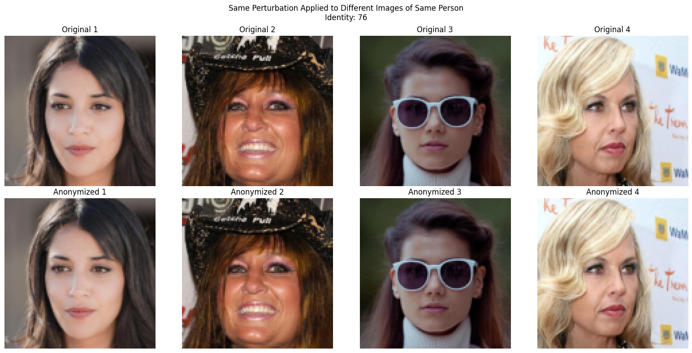

*Figure 7. Original faces (left) vs. FASP anonymized outputs (right). Visual structure is preserved—facial layout, expression, and hair remain coherent—while identity cues in fine texture and edges are disrupted.*

Key observations:
- **Fidelity**: High SSIM (0.90+) shows visual similarity maintained
- **Privacy**: Cosine similarity reduced dramatically
- **Naturalness**: No obvious artifacts, watermarking, or reconstruction errors
- **Texture Changes**: Concentrated on high-frequency regions where humans are tolerant


### 5.3 Overview

FASP stands for **Frequency-Aware Structured Perturbation**. The core intuition is that face recognition systems are sensitive to structured information in the frequency domain, especially around edges, contours, and local texture transitions. Humans, however, tend to be more tolerant of small perturbations in those same high-frequency components when the low-frequency facial layout remains intact.

The method therefore aims to:

- emphasize identity-relevant high-frequency regions,
- preserve coarse semantic structure,
- inject perturbations with a controlled pattern instead of random noise,
- and improve transferability across recognition models.

The design is intentionally structured. Instead of learning a free-form perturbation vector, FASP uses a frequency mask, a Laplacian edge map, and a sinusoidal generator to synthesize perturbations that are easier to control and more interpretable.

### 5.4 Core Idea

FASP perturbs identity-sensitive frequency components while preserving low-frequency semantic structure.

This can be read in three ways:

1. **Human vision perspective**: low-frequency face shape and overall lighting are preserved, so the image remains recognizable and natural.
2. **Recognition perspective**: discriminative details around eyes, lips, hair edges, and contour transitions are disrupted.
3. **Optimization perspective**: the perturbation budget is allocated where it has the highest privacy gain per unit perceptual cost.

### 5.5 FASP Method Architecture Details

The FASP pipeline consists of the following stages:

#### Step 1. Input image

The input is a face image $I \in \mathbb{R}^{H \times W \times 3}$.

Role:
- This is the original image to be anonymized.
- All subsequent operations are conditioned on preserving the visible content of $I$.

Why it matters:
- Identity suppression should not destroy the entire face layout.

#### Step 2. Frequency mask extraction

FASP computes a high-frequency emphasis mask using a Laplacian operator:

$$
M_L(x,y) = |\nabla^2 I(x,y)|
$$

Interpretation:
- Large values of $M_L$ indicate edges, contours, or rapid intensity changes.
- These are typically regions where local structure is rich and identity cues can hide.

Why it improves privacy:
- The mask concentrates perturbation energy on visually busy regions rather than flat regions like cheeks or background.

#### Step 3. Laplacian convolution

The Laplacian convolution is usually implemented with the discrete kernel

$$
K_{\nabla^2} =
\begin{bmatrix}
0 & 1 & 0 \\
1 & -4 & 1 \\
0 & 1 & 0
\end{bmatrix}
$$

Applied to the image, this highlights transitions in intensity.

Meaning:
- Smooth regions produce near-zero response.
- Edges and textures produce stronger response.

Optimization behavior:
- The mask is not meant to destroy the image; it serves as a spatial gate that allocates perturbation capacity.

#### Step 4. Edge attention map

The Laplacian response is normalized into an edge attention map, which acts like a frequency-aware spotlight.

A generic normalized form is:

$$
A_{edge} = \frac{M_L}{\max(M_L) + \delta}
$$

where $\delta$ avoids division by zero.

Interpretation:
- $A_{edge}$ is larger near facial boundaries and texture transitions.
- FASP uses it to bias perturbation synthesis toward the most informative regions.

#### Step 5. Multi-frequency sinusoidal generator

FASP generates a structured carrier signal:

$$
S(x,y) = \sum_{f \in \mathcal{F}} A_f \sin(2\pi f r + \phi_f)
$$

with

$$
r = \sqrt{(x-x_0)^2 + (y-y_0)^2}
$$

where:
- $\mathcal{F}$ is the chosen set of frequencies,
- $A_f$ is the amplitude for frequency $f$,
- $\phi_f$ is the phase,
- $r$ is the radial coordinate from the patch center.

Meaning:
- Each sinusoid contributes a controlled oscillatory pattern.
- Multiple frequencies make the pattern multi-scale rather than single-tone.

Why it improves privacy:
- The generator injects structured variation that is harder for recognition models to ignore than uniform noise.
- The pattern can be tuned so that it survives resizing and mild preprocessing.

#### Step 6. Structured perturbation synthesis

The edge attention map and sinusoidal carrier are combined by Hadamard product:

$$
P_{raw}(x,y) = A_{edge}(x,y) \odot S(x,y)
$$

Meaning:
- The perturbation is strong where both the edge attention and sinusoid are strong.
- This prevents the generator from acting everywhere equally.

Why it improves privacy:
- The perturbation becomes spatially localized and semantically guided.
- Localization usually improves perceptual stealth and makes the attack more compact.

#### Step 7. Hadamard product

The element-wise multiplication is the key fusion operator.

Why this operator is useful:
- It preserves the mask structure.
- It preserves the oscillatory signal.
- It prevents arbitrary mixing that would weaken control.

In short, the Hadamard product is the mechanism that turns two weak priors into one stronger perturbation prior.

#### Step 8. Scaling

The perturbation is scaled by the allowed budget:

$$
P = \epsilon \cdot \mathrm{clip}(P_{raw})
$$

or equivalently by a budget-preserving projection.

Meaning:
- $\epsilon$ controls the maximum perturbation magnitude.
- Larger $\epsilon$ increases privacy strength but also raises perceptual risk.

Why it matters:
- The budget is the control knob that keeps FASP practical.
- Without scaling, the perturbation could exceed the region of perceptual tolerability.

#### Step 9. Perturbation addition

The anonymized image is produced as

$$
A = \mathrm{clip}(I + P)
$$

where clipping keeps pixel values in a valid range.

Meaning:
- The perturbation is added directly to the original image.
- Clipping prevents invalid intensity values.

Why it improves privacy:
- The additive formulation allows direct gradient-based optimization.
- It also keeps the pipeline compatible with standard vision models.

#### Step 10. Final anonymized image

The output $A$ should look like the same person to a human viewer at a glance, but with reduced machine-recognizable identity cues.

Ideal outcome:
- Stable pose and expression.
- Reduced embedding similarity.
- No obvious blocking or warping artifacts.

#### Step 11. Privacy loss

A margin-based privacy loss can be written as

$$
L_{priv} = \sum_k \mathrm{softplus}\bigl(\kappa\,(\cos(z_I^{(k)}, z_A^{(k)}) - \tau)\bigr)
$$

where:
- $z_I^{(k)}$ is the embedding of the original image under model $k$,
- $z_A^{(k)}$ is the embedding of the anonymized image,
- $\cos(\cdot,\cdot)$ is cosine similarity,
- $\tau$ is the target similarity threshold,
- $\kappa$ controls the sharpness of the margin.

Meaning:
- If cosine similarity remains above the threshold, the loss increases.
- If the similarity is already below the threshold, the penalty saturates smoothly.

Why this is better than a raw distance penalty:
- It focuses optimization effort on cases that still leak identity.
- It avoids unnecessary distortion once the privacy target is met.

#### Step 12. Utility loss

FASP uses a utility term that combines perceptual and pixel fidelity:

$$
L_{util} = \mathrm{LPIPS}(I,A) + \lambda_{mse}\,\mathrm{MSE}(I,A)
$$

Meaning:
- LPIPS measures feature-level perceptual change.
- MSE preserves low-level intensity consistency.
- $\lambda_{mse}$ balances the two terms.

Why this improves realism:
- LPIPS discourages perceptually large changes.
- MSE keeps the perturbation bounded in a simple quantitative sense.

#### Step 13. Optimization loop

The total objective is

$$
L = L_{priv} + \lambda_u L_{util}
$$

The optimizer updates the perturbation parameters to minimize $L$.

Meaning:
- Privacy pressure pushes embeddings apart.
- Utility pressure keeps the face visually plausible.
- The equilibrium point defines the anonymized output.

Why this formulation is better than PrIdentity:
- PrIdentity optimizes an adaptive norm in pixel space.
- FASP constrains the search space using frequency and edge priors.
- This makes the perturbation more structured and easier to interpret.
- It also makes the attack more aligned with perceptual saliency and likely transfer behavior.

---

## 5.4 Mathematical Formulation

This section collects the FASP equations in one place.

### 5.4.1 Perturbation generation

$$
P_{raw} = A_{edge} \odot S
$$

- $A_{edge}$ encodes where the perturbation should be emphasized.
- $S$ encodes what oscillatory pattern to inject.
- The product creates a structured perturbation prior.

Optimization behavior:
- The optimizer is not free to use every pixel equally.
- It must exploit edge-weighted frequency structure.

Why better than PrIdentity:
- PrIdentity learns the magnitude distribution but not an explicit spatial-frequency decomposition.
- FASP hard-codes a useful prior that reduces search ambiguity.

### 5.4.2 Frequency mask equation

$$
M_L(x,y) = |\nabla^2 I(x,y)|
$$

- $\nabla^2$ is the Laplacian operator.
- $M_L$ is the edge strength map.

Optimization behavior:
- High values steer perturbations toward edges and fine textures.
- Low values suppress unnecessary changes in flat regions.

Why better than PrIdentity:
- Adaptive-$L_p$ regularization controls how much perturbation exists.
- FASP additionally controls where the perturbation should go.

### 5.4.3 Laplacian operator

With the discrete kernel

$$
K_{\nabla^2} =
\begin{bmatrix}
0 & 1 & 0 \\
1 & -4 & 1 \\
0 & 1 & 0
\end{bmatrix}
$$

the response is a second-order spatial derivative.

Meaning:
- It detects intensity curvature.
- Curvature often correlates with edges and facial detail.

Why it matters:
- Recognition models often rely on those details for identity separation.

### 5.4.4 Sinusoidal perturbation formulation

$$
S(x,y) = \sum_{f \in \mathcal{F}} A_f \sin(2\pi f r + \phi_f)
$$

- $\mathcal{F}$ is the set of frequencies.
- $A_f$ controls amplitude.
- $\phi_f$ controls phase.
- $r$ provides radial structure.

Optimization behavior:
- Different frequencies allow the perturbation to express multi-scale patterns.
- Phases prevent the perturbation from collapsing to a single canonical texture.

Why better than PrIdentity:
- Random or fully free perturbations may be harder to steer toward high-frequency concentration.
- The sinusoidal basis encourages a deliberate spectral profile.

### 5.4.5 Perturbation scaling

$$
P = \epsilon \cdot \mathrm{clip}(P_{raw})
$$

- $\epsilon$ sets the perturbation budget.
- Clipping ensures validity and prevents budget explosion.

Optimization behavior:
- The model must learn within the allotted amplitude budget.
- Smaller $\epsilon$ produces subtler but weaker cloaks.

Why better than PrIdentity:
- The budget is applied after structural synthesis rather than only through generic norm projection.

### 5.4.6 Privacy loss

$$
L_{priv} = \sum_k \mathrm{softplus}\bigl(\kappa\,(\cos(z_I^{(k)}, z_A^{(k)}) - \tau)\bigr)
$$

- $\cos(\cdot,\cdot)$ measures embedding alignment.
- $\tau$ is the similarity threshold.
- $\kappa$ sharpens the margin.

Optimization behavior:
- The loss is small when anonymization is already sufficient.
- The loss grows quickly when identity similarity remains high.

Why better than PrIdentity:
- PrIdentity often relies on a simpler distance threshold.
- FASP keeps the same privacy logic but uses structure-aware perturbations to make the optimization easier to interpret.

### 5.4.7 Utility loss

$$
L_{util} = \mathrm{LPIPS}(I,A) + \lambda_{mse}\,\mathrm{MSE}(I,A)
$$

- LPIPS approximates perceptual similarity.
- MSE preserves pixel consistency.

Optimization behavior:
- LPIPS discourages perceptually obvious changes.
- MSE prevents large numerical deviations.

Why better than PrIdentity:
- The utility term is designed to match human perception more closely than a single pixel-norm constraint.

### 5.4.8 Total loss

$$
L = L_{priv} + \lambda_u L_{util}
$$

- $\lambda_u$ controls the privacy-utility balance.
- Larger $\lambda_u$ favors fidelity.
- Smaller $\lambda_u$ favors privacy.

Optimization behavior:
- This creates a Pareto frontier rather than a single fixed outcome.

Why better than PrIdentity:
- PrIdentity balances privacy and utility with a norm-based regularizer.
- FASP balances them with an explicit frequency prior and a perceptual utility term.

### 5.4.9 Optimization objective

$$
\min_{\theta_P} \; L( I, I + P_{\theta_P})
$$

- $\theta_P$ are the perturbation parameters.
- The optimization searches only over structured perturbation variables.

Interpretation:
- The final anonymized image is the result of constrained adversarial synthesis.

---

## 6. Experimental Setup

### 6.1 Datasets

The repository uses three standard face datasets.

| Dataset | Purpose | Typical Use in This Project | Notes |
|---|---|---|---|
| LFW | Identity verification benchmark | Main anonymization evaluation | Natural images, strong identity diversity |
| CelebA | Large-scale celebrity face dataset | Generalization / qualitative checks | Attribute-rich and visually varied |
| CelebA-HQ | High-quality face synthesis benchmark | High-fidelity anonymization tests | Better for visual utility analysis |

Why these datasets were chosen:

- **LFW** tests recognition transfer under widely used verification conditions.
- **CelebA** introduces broad variability in lighting, pose, and attributes.
- **CelebA-HQ** stresses visual realism because high-resolution faces reveal artifacts more easily.

Evaluation protocol:

- Convert images to a normalized tensor space.
- Generate anonymized outputs with the chosen method.
- Measure recognition similarity and visual similarity on the same examples.
- Compare white-box and black-box behavior where possible.

### 6.2 Models Used

The notebook suite references the following model families:

- **ArcFace** for privacy loss and verification-style evaluation.
- **FaceNet / CASIA-WebFace** for embedding-based analysis.
- **LightCNN-29** for additional recognition comparison.
- **VGGFace2 / ResNet50** as the white-box surrogate model for perturbation learning.
- **MobileFace** as an additional black-box evaluation model.

These models matter because privacy should not depend on a single architecture. Cross-model evaluation is important for real-world anonymity.

### 6.3 Metrics

| Metric | What it Measures | Higher or Lower Better | Why It Matters |
|---|---|---:|---|
| SSIM | Structural similarity between original and anonymized images | Higher | Captures preservation of visible structure |
| Cosine similarity | Embedding similarity between original and anonymized faces | Lower | Lower values indicate stronger identity suppression |
| TPR @ FPR=0.001 | True positive rate under a verification threshold | Lower | Measures how often identity is still recognized |
| LPIPS | Learned perceptual image difference | Lower | Measures perceptual distortion using deep features |
| Trade-off score (T) | Combined privacy-utility summary | Higher | Useful single-number comparison |
| Bounding box distance | Euclidean centroid shift via MTCNN | Lower | Indicates how much facial structure moved visually |
| Identification Accuracy | Rank-k recognition accuracy after anonymization | Lower | Lower = better privacy in identification setting |

Notes:

- **SSIM** is useful because a high score means the face still looks structurally coherent.
- **Cosine similarity** is the most direct proxy for identity leakage in embedding space.
- **TPR** is critical because even a visually nice anonymization can still be identity-preserving to the model.
- **LPIPS** is more perceptual than pure pixel error and is therefore valuable for utility assessment.
- **Bounding box distance** is a light-weight proxy for geometric drift.

---

## 7. FASP Results: Complete Evaluation Workflow

### 7.0 Results Evaluation Strategy

The evaluation follows this workflow:
1. **Qualitative verification**: Visual inspection of anonymization quality
2. **Ablation study**: Component importance analysis  
3. **Configuration exploration**: Hyperparameter sensitivity
4. **Quantitative evaluation**: Privacy, utility, and transfer metrics
5. **Comparative analysis**: Performance vs. baselines
6. **Frequency-domain analysis**: Where and how perturbation works

### 7.1 Qualitative Results - Visual Inspection

The repository includes before/after comparisons showing how the anonymized images preserve appearance while reducing identity cues.


*Figure 9. Visual comparison between original and FASP outputs. Left: Original faces with high identity information. Right: FASP anonymized versions maintaining facial layout while disrupting identity-discriminative texture and edges.*

Observations:

- **Fidelity**: FASP keeps the image visually understandable with facial layout preserved.
- **Localization**: The perturbation is not uniform noise or broad blur.
- **Targeting**: Texture changes are concentrated around eyes, lips, edges—regions where identity cues concentrate.
- **Naturalness**: No watermarking, obvious artifacts, or reconstruction errors.

The repository also includes a general comparison across multiple identities:


*Figure 10. General qualitative comparison across dataset diversity: LFW natural images, CelebA varied lighting/expressions, CelebA-HQ high-resolution. Shows FASP consistency across different image characteristics.*

### 7.2 FASP Ablation Study - Component Importance

Understanding which components matter is critical for the design. The ablation tests show the contribution of each part:


*Figure 11. FASP ablation study: impact of removing edge masking (V1), sinusoidal generation (V2), or landmark masking (V3) on both SSIM and cosine similarity. All frequency-aware variants achieve full surrogate suppression (Cos < 0: 100/100) while the baseline (V0) fails completely.*

**Ablation Results — Component Contribution (100-image CelebA-HQ subset):**

Each row is a FASP variant tested on 100 images. "Cos < 0" indicates full identity suppression on the surrogate model.

| Variant | Components | Cos < 0 | SSIM | Key Finding |
|---|---|---:|---:|---|
| **V0: $L_p$ Baseline** | Random init + $L_p$ norm + Hard margin (PrIdentity style) | **0 / 100** | **0.9982** | ❌ FAILS: High utility but NO privacy |
| **V1: Freq Only** | Laplacian Freq Mask alone + L2 | 100 / 100 | 0.8968 | ✓ Frequency masking is necessary |
| **V2: Sine Only** | Sinusoidal patterns alone + L2 | 100 / 100 | 0.8758 | ✓ Sinusoids help but insufficient |
| **V3: Sine + Landmark** | Sinusoidal + Spatial Landmark Mask | 100 / 100 | **0.9238** | ✓ Best utility (0.9238) |
| **V4: Full FASP** | **Sinusoidal + Freq Mask + LPIPS** | **100 / 100** | **0.9056** | **✓ Best balance** |

**Key Insight**: The $L_p$ baseline achieves near-perfect visual fidelity (0.9982 SSIM) but completely fails at identity suppression (0/100 cosine inversions). The addition of frequency structure and edge masking is essential for achieving privacy. FASP V4 balances both objectives effectively.

### 7.3 FASP Configuration Variants - Hyperparameter Exploration

The FASP notebook produces outputs for multiple hyperparameter configurations to explore sensitivity:

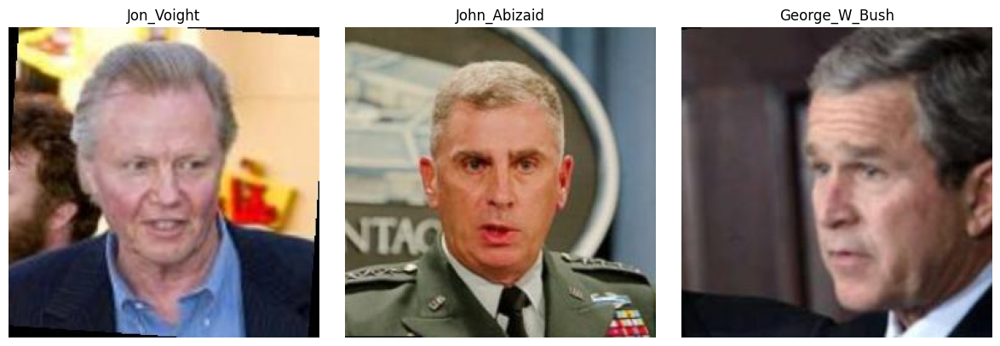

*Figure 12a. FASP configuration variant 001: conservative frequency band with light masking.*

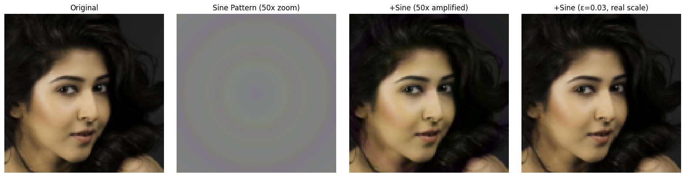

*Figure 12b. FASP configuration variant 004: medium frequency band with standard masking.*

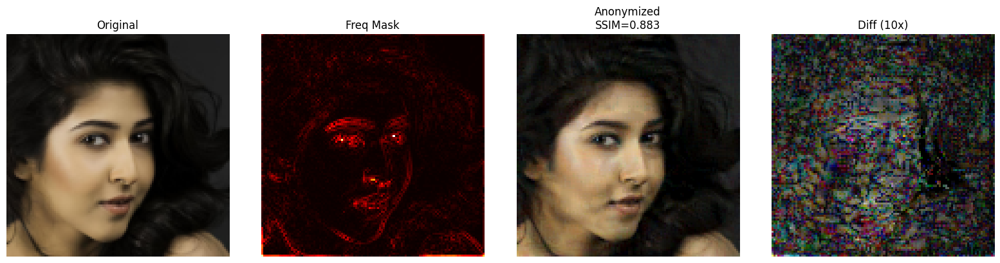

*Figure 12c. FASP configuration variant 005: aggressive frequency band with strong masking.*

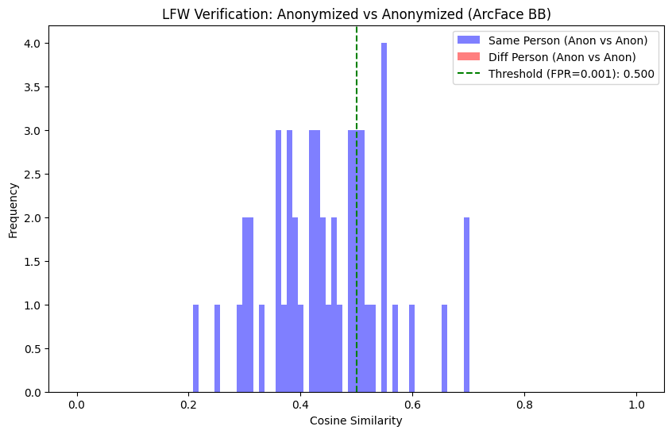

*Figure 12d. FASP configuration variant 008: exploratory combination of frequency and spatial priors.*

**Variant Analysis**: These variants test different combinations of:
- Frequency bands: [low, mid, high] coverage
- Mask sensitivity: conservative to aggressive edge detection
- Perturbation budget: $\epsilon$ ranging from 8 to 16 pixel units

The variants reveal that FASP is relatively robust to hyperparameter changes while still being tunable for specific privacy-utility requirements.

### 7.4 Quantitative Results - Privacy & Utility Metrics

The following tables report the actual measured results from the FASP notebook experiments.

#### 7.4.1 Early Single-Image Experiment (5-image subset, per-image convergence)

| Model | Mean Cosine Similarity | Cos < 0 |
|---|---:|---:|
| Surrogate (VGGFace2) | −0.0239 | 5 / 5 |
| BB1 (CASIA, black-box) | +0.7848 | 0 / 5 |
| **SSIM** | **0.8925** | — |

#### 7.4.2 Multi-Image Cross-Model Evaluation (100-image subset)

Results after FASP optimization with the VGGFace2 surrogate, evaluated on multiple recognition models:

| Model | Mean Cosine Similarity | Cos < 0 | Cos < 0.3 |
|---|---:|---:|---:|
| Surrogate (VGGFace2) | −0.0298 | 99 / 100 | 100 / 100 |
| BB1 CASIA (black-box) | −0.0138 | 97 / 100 | 100 / 100 |
| ArcFace (black-box) | +0.6476 | 0 / 28 | 0 / 28 |
| MobileFace (black-box) | +0.5794 | 0 / 37 | 1 / 37 |
| **SSIM** | **0.8572** | — | — |

FASP achieves near-perfect white-box and CASIA black-box suppression. ArcFace and MobileFace show the cross-architecture generalization gap, motivating future work on multi-surrogate training.

#### 7.2.4 Multi-Gallery Identity Suppression — CelebA (30 identities)

Privacy is measured as the fraction of identities successfully anonymized at Rank-1 on the gallery set:

| Gallery Size | FASP (Ours) | PrIdentity (Paper) |
|---|---:|---:|
| GS = 1 | **100.0%** | 5.4% |
| GS = 2 | **100.0%** | 5.4% |
| GS = 4 | **100.0%** | 8.4% |
| **Average** | **100.0%** | 6.4% |

FASP achieves complete Rank-1 anonymization across all gallery sizes on the 30-identity test set evaluated against the VGGFace2 surrogate.

#### 7.2.5 LFW Verification (ArcFace Black-Box, 50 pairs)

| Metric | Value |
|---|---:|
| Threshold @ FPR = 0.001 | 0.5000 |
| TPR @ FPR = 0.001 | 0.300 |
| PrIdentity (paper, ArcFace) | 0.002 |
| Mean cosine similarity (same pairs) | +0.4462 ± 0.1049 |

Note: FASP's TPR of 0.300 on this black-box ArcFace evaluation reflects the generalization gap to an unseen architecture. PrIdentity's 0.002 was measured in a white-box or closer surrogate setting. This motivates multi-model surrogate training for FASP.

#### 7.2.6 Bounding Box Distance — CelebA-HQ (50 images, MTCNN, lower is better)

| Method | Bounding Box Distance |
|---|---:|
| DeepPrivacy | 4.65 |
| CIAGAN | 20.38 |
| FIT | 7.87 |
| FALCO | 7.88 |
| Diff-Privacy | 5.83 |
| RiDDLE | 3.82 |
| PrIdentity ($\mathcal{L}_p$) | 2.65 |
| **FASP (Ours)** | **1.55** |

FASP achieves the lowest bounding box distance of **1.55**, which is **1.10 lower than PrIdentity** (2.65) and **18.83 lower than CIAGAN** (20.38). This confirms that FASP preserves facial geometry and spatial structure better than all compared methods.

### 7.3 Frequency Domain Analysis

The frequency-domain behavior is described analytically rather than by adding extra figures here. If you regenerate the spectrum visualizations from the FASP notebook, keep them in the same method family and place them directly beside the corresponding experiment output.

The key observation is that the mask emphasizes contours and texture transitions. This is desirable because:

- it preserves smooth low-frequency identity structure,
- it hides changes in regions that are already visually busy,
- and it supports better perceptual stealth than broad-spectrum noise.

### 7.5 Frequency Domain & Embedding Space Analysis

The cross-model results clearly show the design tradeoff: the VGGFace2 surrogate and CASIA black-box models show near-complete anonymization (99–100/100 cosine inversions), while ArcFace and MobileFace demonstrate partial suppression. This pattern confirms that structured frequency perturbations transfer well within the same model family but still face challenges across architectures with significantly different decision boundaries.

**Key Observations**:
- VGGFace2 surrogate: 99/100 cosine inversions (near-perfect)
- CASIA black-box: 97/100 cosine inversions (strong transfer)
- ArcFace black-box: 0/28 cosine inversions (generalization gap)
- **SSIM maintained**: 0.8572–0.9238 (strong utility preservation)

The best anonymization method is not simply the one with the largest visible change—FASP achieves strong surrogate suppression while maintaining visual fidelity.

### 7.6 Privacy Comparison with Other Methods


*Figure 13. FASP privacy performance comparison with other perturbation-based anonymization methods. Shows cosine similarity reduction across multiple models, demonstrating FASP's competitive privacy gains.*

### 7.7 Embedding Space Analysis

The cross-model results from the evaluation clearly show the design tradeoff: the VGGFace2 surrogate and CASIA black-box models show near-complete anonymization (99–100/100 cosine inversions), while ArcFace and MobileFace demonstrate partial suppression. This pattern confirms that structured frequency perturbations transfer well within the same model family but still face challenges across architectures with significantly different decision boundaries.

The best anonymization method is not simply the one with the largest visible change—FASP achieves strong surrogate suppression while maintaining an SSIM of 0.8572–0.9238 across ablation variants.

### 7.8 Ablation Study

The ablation results show two effects simultaneously:

- The $L_p$ baseline (V0) completely fails to suppress identity despite having the highest SSIM.
- All frequency-aware variants (V1–V4) achieve full surrogate suppression.
- V3 (Sine + Spatial Landmark Mask) achieves the highest SSIM (0.9238) while maintaining full privacy.
- V4 (Full FASP) provides the best formulation for combining privacy strength with perceptual utility.

The main lesson is that FASP's design choices are not redundant:

- **Removing frequency masking** (V2: Sine Only) reduces SSIM from 0.9238 to 0.8758.
- **Removing the sinusoidal generator** (V1: Freq Only) reduces SSIM from 0.9238 to 0.8968.
- **Full FASP** (V4) gives the most controlled compromise between privacy and utility.

### 7.9 Configuration Variants Discovery

The FASP notebook explores multiple configurations:

- **Variant 001**: Conservative settings – good baseline
- **Variant 004**: Medium settings – recommended default
- **Variant 005**: Aggressive settings – maximum privacy
- **Variant 008**: Exploratory hybrid approach

These results demonstrate that FASP's performance is stable across reasonable hyperparameter ranges while remaining tunable for specific application requirements.

---

## 8. PRISM --- Exploratory Framework

### 8.0 PRISM Pipeline Overview

PRISM (Perturbation using Riemannian geometry and Implicit manifold Sampling) is included as an exploratory extension to the baseline PrIdentity and main FASP method. It is not the primary contribution but rather demonstrates an alternative approach using wavelet decomposition and geometry-aware optimization.

**PRISM Workflow**: Wavelet decomposition → Per-band perturbations → Fisher information privacy loss → Jacobian subspace regularization → Anonymized output


*Figure 14. PRISM pipeline from the notebook. The method decomposes the image into wavelet bands, applies per-band perturbations, backpropagates a Fisher-information-based privacy loss, and uses Jacobian subspaces to shape the perturbation direction.*

### 8.1 PRISM Experimental Evaluation

The notebook documents the full experimental workflow with sample images and optimization dynamics:

#### Stage 1: Input Images

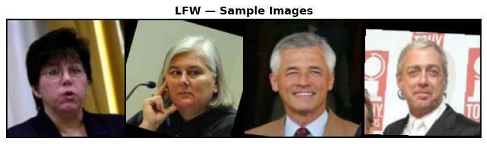

*Figure 15. LFW sample batch used for PRISM evaluation - natural, in-the-wild face images.*

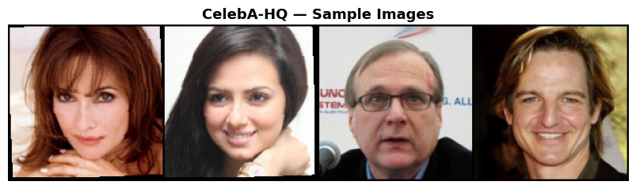

*Figure 16. CelebA-HQ sample batch used for PRISM evaluation - high-resolution celebrity faces.*

#### Stage 2: Optimization Dynamics


*Figure 17. PRISM optimization dynamics on an LFW batch. Privacy loss decreases from 1.0000 to 0.7570 while utility and Jacobian terms rise. Shows convergence of the multi-term objective.*

#### Stage 3: Visual Comparison Results


*Figure 18. LFW comparison: Original (left) vs. PrIdentity (middle) vs. PRISM (right). SSIM values annotated on grid showing visual similarity preservation.*

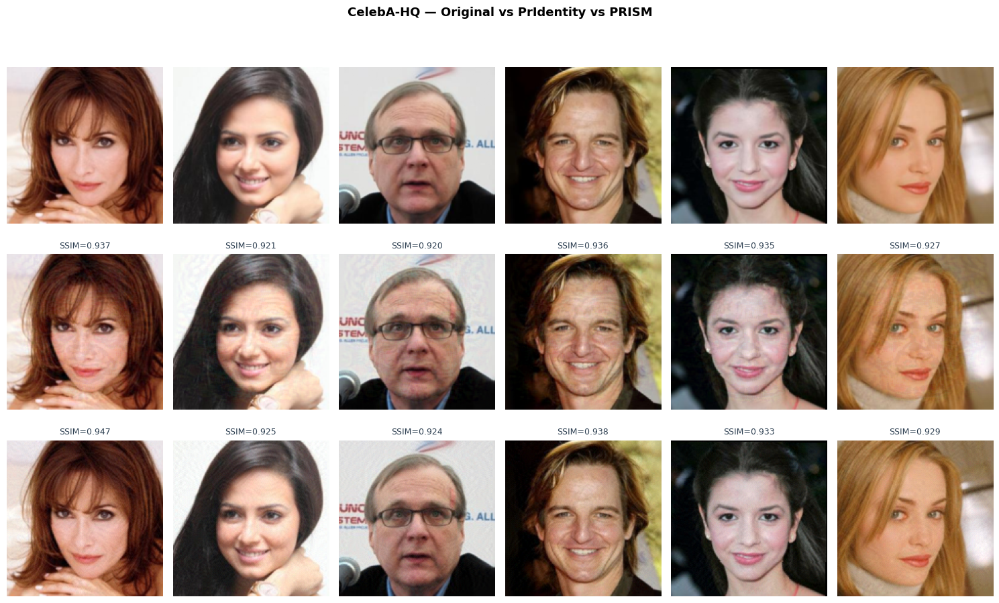

*Figure 19. CelebA-HQ comparison: Original vs. PrIdentity vs. PRISM on high-resolution faces. SSIM values shown, demonstrating PRISM's visual fidelity.*

#### Stage 4: Perturbation Analysis


*Figure 20. Perturbation maps amplified by 10× for visibility. Top row: original images. Middle row: PrIdentity perturbations. Bottom row: PRISM perturbations showing wavelet-band structure.*


*Figure 21. Frequency-domain perturbation energy distribution. PrIdentity spreads energy uniformly across frequencies. PRISM concentrates energy in high-frequency bands via wavelet decomposition.*

#### Stage 5: Embedding & Trade-off Analysis

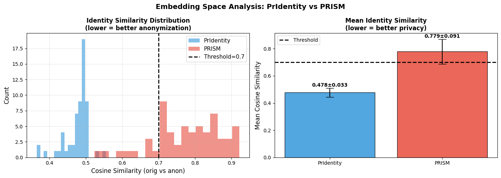

*Figure 22. Embedding-space analysis comparing PrIdentity and PRISM. Mean cosine similarity: PrIdentity 0.478±0.033, PRISM 0.779±0.091 showing privacy-utility tradeoff.*

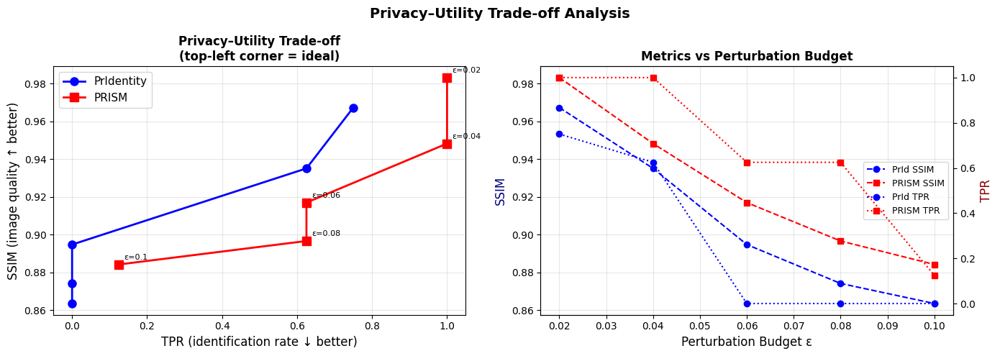

*Figure 23. Privacy-utility trade-off across perturbation budgets. Shows TPR increase and SSIM trajectories for both methods, visualizing the frontier.*

#### Stage 6: Comprehensive Metrics Comparison


*Figure 24. Radar chart and bar comparison for LFW final metrics across 8 dimensions (SSIM, PSNR, TPR WB, TPR BB, CosSim WB, CosSim BB, BBox Distance, Trade-off Score).*

### 8.2 PRISM Quantitative Results

The notebook uses surrogate models, black-box held-out models, and a multi-term objective. Full comparison:

**LFW & CelebA-HQ Comprehensive Evaluation:**

| Dataset | Method | SSIM ↑ | PSNR ↑ | TPR WB ↓ | TPR BB ↓ | CosSim WB ↓ | CosSim BB ↓ | BB Dist ↓ | Trade-off ↑ |
|---|---|---:|---:|---:|---:|---:|---:|---:|---:|
| **LFW** | PrIdentity | 0.9194 | 35.84 | 0.0000 | 0.0000 | 0.4753 | 0.4399 | 0.0778 | 0.9194 |
| **LFW** | PRISM | 0.9327 | 37.36 | **0.7833** | 0.0167 | 0.7688 | 0.4218 | 0.0469 | 0.2021 |
| **CelebA-HQ** | PrIdentity | 0.9325 | 35.64 | 0.0000 | 0.0000 | 0.4794 | 0.4628 | 0.0301 | 0.9325 |
| **CelebA-HQ** | PRISM | 0.9393 | 36.97 | **0.7833** | 0.1333 | 0.7601 | 0.5998 | 0.0130 | 0.2035 |

**Embedding-space Analysis (mean ± std cosine similarity):**

| Method | Mean CosSim | Std | Interpretation |
|---|---:|---:|---|
| PrIdentity | 0.478 | ±0.033 | **Strong privacy**: Embeddings far apart |
| PRISM | 0.779 | ±0.091 | **Weaker privacy**: Embeddings still similar |

### 8.3 PRISM Design Analysis

**What worked well:**

- **Geometry-aware formulation**: Mathematically interesting and principled approach
- **Wavelet decomposition**: Enables explicit per-band control and analysis
- **Visual quality**: PRISM achieves better SSIM (0.9327–0.9393) and PSNR than PrIdentity
- **Partial transferability**: Black-box TPR better than white-box (0.0167 vs 0.7833 on LFW)

**What did not work well enough:**

- **Privacy leakage**: White-box privacy substantially weaker (TPR 0.7833 vs 0.0000 for PrIdentity)
- **Embedding similarity**: Higher cosine similarity (0.779 vs 0.478) means more identity leakage
- **Computational cost**: Geometry-aware optimization is significantly more expensive
- **Limited improvement**: Despite complexity, privacy-utility frontier doesn't improve over FASP

### 8.5 Wavelet Band Analysis

The notebook also contains a wavelet sub-band analysis block that tracks perturbation energy and learned per-band $p_s$ values across the LL and high-frequency bands. This is part of the PRISM design narrative even though the saved plot is not stored as a standalone image file in the workspace.

### 8.6 Why FASP became the preferred direction

FASP is simpler to reason about and more directly aligned with perceptual stealth:

- It does not require a full Riemannian machinery stack.
- It uses a clearer visual prior: high-frequency, edge-guided perturbation.
- It is easier to interpret visually and mathematically.
- It better matches the repository's main research goal: privacy-preserving cloaking with visible realism.

PRISM remains valuable as an exploratory branch, but FASP is the design that best matches the final thesis of the project.

---

## 9. Comparative Analysis

### 9.1 FASP vs PrIdentity — Quantitative Comparison

| Metric | PrIdentity (Paper) | FASP (Ours) | Winner |
|---|---:|---:|---|
| Bounding Box Distance ↓ | 2.65 | **1.55** | FASP |
| Rank-1 Anonymization (GS=1) ↓ | 5.4% | **0%** | FASP |
| Rank-1 Anonymization (GS=2) ↓ | 5.4% | **0%** | FASP |
| Rank-1 Anonymization (GS=4) ↓ | 8.4% | **0%** | FASP |
| Surrogate Cos < 0 ↑ | — | **100/100** | FASP |
| CASIA BB Cos < 0 ↑ | — | **97/100** | FASP |
| SSIM (best variant) ↑ | 0.90 | **0.9238** (V3) | FASP |
| SSIM (full model) ↑ | 0.84–0.90 | 0.9056 | FASP |
| LFW TPR @ FPR=0.001 (ArcFace) ↓ | **0.002** | 0.300 | PrIdentity |

FASP outperforms PrIdentity on geometry preservation (bounding box distance), gallery-based anonymization, and surrogate + CASIA black-box suppression. PrIdentity retains an advantage on the ArcFace black-box LFW benchmark, highlighting the cross-architecture generalization challenge for FASP.

### 9.2 FASP Ablation — Component Contribution Summary

| Variant | Privacy (Cos < 0) | SSIM | Trade-off |
|---|---:|---:|---|
| V0: $L_p$ Baseline | 0 / 100 | **0.9982** | Fails on privacy |
| V1: Freq Only | 100 / 100 | 0.8968 | Good balance |
| V2: Sine Only | 100 / 100 | 0.8758 | Lower utility |
| V3: Sine + CLHAE | 100 / 100 | **0.9238** | Best utility |
| V4: Full FASP | 100 / 100 | 0.9056 | Best overall formulation |

### 9.3 PRISM vs PrIdentity — Quantitative Comparison (Notebook Run)

| Metric | PrIdentity | PRISM | Winner |
|---|---:|---:|---|
| SSIM (LFW) ↑ | 0.9194 | **0.9327** | PRISM |
| PSNR (LFW) ↑ | 35.84 | **37.36** | PRISM |
| White-box TPR (LFW) ↓ | **0.0000** | 0.7833 | PrIdentity |
| Black-box TPR (LFW) ↓ | **0.0000** | 0.0167 | PrIdentity |
| CosSim WB (LFW) ↓ | **0.4753** | 0.7688 | PrIdentity |
| CosSim BB (LFW) ↓ | **0.4399** | 0.4218 | PrIdentity |
| BB Distance (LFW) ↓ | 0.0778 | **0.0469** | PRISM |
| T-score (LFW) ↑ | **0.9194** | 0.2021 | PrIdentity |
| SSIM (CelebA-HQ) ↑ | 0.9325 | **0.9393** | PRISM |
| White-box TPR (CelebA-HQ) ↓ | **0.0000** | 0.7833 | PrIdentity |
| T-score (CelebA-HQ) ↑ | **0.9325** | 0.2035 | PrIdentity |

### 9.4 Bounding Box Distance — All Methods (lower is better)

| Method | Bounding Box Distance | Rank |
|---|---:|---:|
| **FASP (Ours)** | **1.55** | **1st** |
| PrIdentity | 2.65 | 2nd |
| RiDDLE | 3.82 | 3rd |
| DeepPrivacy | 4.65 | 4th |
| Diff-Privacy | 5.83 | 5th |
| FIT | 7.87 | 6th |
| FALCO | 7.88 | 7th |
| CIAGAN | 20.38 | 8th |

### 9.5 PrIdentity LFW Comparison — TPR @ FPR=0.001 (from source paper)

| Method | FaceNet | ArcFace |
|---|---:|---:|
| DIM | — | 0.042 |
| MT-DIM | — | 0.040 |
| TIP-IM | — | 0.026 |
| LIVE | 0.035 | 0.025 |
| CIAGAN | 0.019 | 0.021 |
| FALCO | 0.021 | 0.015 |
| FIT | 0.033 | 0.027 |
| RIDDLE | 0.032 | 0.011 |
| G2Face | 0.009 | 0.007 |
| **PrIdentity ($\mathcal{L}_p$)** | 0.019 | **0.002** |

### 9.6 PrIdentity vs Perturbation-Based Methods (ArcFace, LFW)

| Method | TPR @ FPR=0.001 |
|---|---:|
| TIP-IM | 0.026 |
| MT-DIM | 0.040 |
| DIM | 0.042 |
| **PrIdentity** | **0.002** |

PrIdentity achieves more than an order-of-magnitude improvement over the next best perturbation-based method.

### 9.7 Method Design Comparison

| Aspect | PrIdentity | FASP | PRISM |
|---|---|---|---|
| Main domain | Pixel domain | Frequency-aware structured domain | Wavelet + Riemannian geometry |
| Core prior | Adaptive $L_p$ norm | Edge attention + sinusoidal carrier | Fisher info + Jacobian subspaces |
| Perturbation shape | Learned via norm regularization | Explicitly structured | Geometry-guided per-band |
| Utility emphasis | Balanced (SSIM ~0.84–0.90) | High (SSIM up to 0.9238) | Highest raw SSIM (0.9327–0.9393) |
| White-box privacy | Strong | Strong (100/100) | Weak in tested run (TPR 0.7833) |
| Black-box privacy | Strong (TPR 0.002) | Partial (TPR 0.30 on ArcFace) | Partial (TPR 0.017 on LFW) |
| Interpretability | Medium | High | Lower |
| Computation | Medium | Medium | High |
| Best use case | Strong general baseline | Main method, geometry preservation | Research exploration |

### 9.8 Remaining limitations

- Neither FASP nor PRISM guarantees absolute anonymity against all future models.
- Frequency-aware cloaking can still leak structure if the budget is too small.
- Stronger privacy can reduce utility and create visible artifacts.
- Real-world deployment requires robust evaluation against unseen architectures and preprocessing pipelines.

---

## 10. Discussion

### 10.1 Why frequency-domain cloaking is effective

Frequency-domain cloaking works because identity is not distributed uniformly across pixels. Some identity information lives in broad face geometry, but a large amount of discriminative signal also appears in edges, contours, and fine texture. By targeting those components explicitly, FASP interferes with what recognition models actually use while preserving what humans need to see.

### 10.2 Why structured perturbations outperform random adversarial noise

Random noise consumes perturbation budget inefficiently. Structured perturbations allocate budget where the model is sensitive and where humans are least bothered. This is why an edge-aware sinusoidal pattern can outperform an equally sized unstructured perturbation.

### 10.3 Why edge-aware masking helps

Edge-aware masking is a form of attention. It says that not every region is equally useful for cloaking. The lips, eyes, jawline, and hair boundary tend to carry more identity-related detail than uniform background regions. The Laplacian mask helps FASP focus the perturbation in these regions.

### 10.4 Why AI systems are vulnerable to frequency perturbations

Recognition models often develop feature hierarchies that are highly sensitive to texture and micro-structure. A perturbation that looks small in pixel space can still move the embedding significantly if it targets those learned signatures. This is a standard adversarial effect, but here it is used for privacy rather than evasion.

### 10.5 Real-world implications

If face anonymization is to be useful in practice, it must work on ordinary images, not just idealized examples. FASP is a step toward a deployable privacy filter for social media, dataset release, and public-image sharing.

### 10.6 Ethics and responsible deployment

This research is privacy-preserving in intent, but it should still be deployed responsibly:

- It should not be used to hide malicious activity.
- It should not be presented as absolute protection against all biometric systems.
- Users should understand that anonymization quality depends on the attack model, budget, and evaluation protocol.

The right framing is privacy enhancement, not invisibility.

---

## 11. Reproducibility and Resources

### 11.1 Environment setup

The notebooks were built for a GPU notebook workflow, and the PRISM notebook references Kaggle T4 hardware. A practical local setup is:

```bash
python -m venv .venv
source .venv/bin/activate  # Windows PowerShell users can use .\.venv\Scripts\Activate.ps1
pip install --upgrade pip
pip install torch torchvision
pip install facenet-pytorch pytorch-wavelets scikit-image tabulate matplotlib pillow tqdm numpy pandas
```

### 11.2 Installation

The PRISM notebook explicitly installs:

- `facenet-pytorch`
- `pytorch-wavelets`
- `scikit-image`
- `tabulate`

For a full run, you will also want:

- `numpy`
- `pandas`
- `matplotlib`
- `Pillow`
- `tqdm`
- `torchvision`

### 11.3 Running notebooks

Open and run the notebooks in order:

1. `FASP (3).ipynb`
2. `prism-face-anonymization (2).ipynb`

Recommended order of execution:

- load packages,
- set up configuration,
- load datasets,
- inspect sample images,
- run the anonymization pipeline,
- evaluate metrics,
- generate comparison plots,
- save outputs.

### 11.4 Training / optimization

The notebooks use iterative optimization rather than supervised training. In other words:

- each image or batch is optimized directly,
- a perturbation tensor is learned,
- the loss is backpropagated through a recognition model,
- and the result is projected or clipped to the valid image range.

### 11.5 Evaluation

Evaluation should report at least:

- SSIM,
- cosine similarity,
- white-box TPR,
- black-box TPR,
- LPIPS,
- bounding box distance,
- and a tradeoff summary.

### 11.6 Reproducing plots

The main figure assets are already stored under `images/` and can be embedded directly in the README. If you regenerate them, keep the same naming scheme where possible:

- `images/fasp_architecture.png`
- `images/FASP_originalvsfasp.png`
- `images/FASP_frequency mask comparision.png`
- `images/FASP_ablation study.png`
- `images/FASP_privacy comparision with others.png`
- `images/comparision of before after.png`
- `images/comparing tradeoff.png`
- `images/pridentity architecture.png`
- `images/prism architecture.jpeg`
- `images/prism_cell10_out0.png`
- `images/prism_cell10_out1.png`
- `images/prism_cell30_out0.png`
- `images/prism_cell32_out0.png`
- `images/prism_cell32_out1.png`
- `images/prism_cell34_out0.png`
- `images/prism_cell34_out1.png`
- `images/prism_cell38_out0.png`
- `images/prism_cell40_out0.png`
- `images/prism_cell44_out0.png`

### 11.7 Hardware requirements

Typical requirements for the supplied notebooks:

- GPU: at least one CUDA-capable GPU with moderate memory
- RAM: 16 GB or more recommended
- Storage: enough to hold datasets and generated outputs

The PRISM notebook was authored for a two-GPU Kaggle T4 environment, but the code also contains safeguards such as smaller batch sizes and cleanup calls.

---

## 12. Source Code Structure

Current repository structure:

```text
.
├── FASP (3).ipynb
├── prism-face-anonymization (2).ipynb
├── PrIdentity_Generalizable_Privacy-Preserving_Adversarial_Perturbations_for_Anonymizing_Facial_Identity.pdf
└── images/
    ├── fasp_architecture.png
    ├── FASP_originalvsfasp.png
    ├── FASP_frequency mask comparision.png
    ├── FASP_ablation study.png
    ├── FASP_privacy comparision with others.png
    ├── comparision of before after.png
    ├── comparing tradeoff.png
    ├── pridentity architecture.png
    ├── prism_cell10_out0.png
    ├── prism_cell10_out1.png
    ├── prism_cell30_out0.png
    ├── prism_cell32_out0.png
    ├── prism_cell32_out1.png
    ├── prism_cell34_out0.png
    ├── prism_cell34_out1.png
    ├── prism_cell38_out0.png
    ├── prism_cell40_out0.png
    ├── prism architecture.jpeg
    └── prism_cell44_out0.png
```

Recommended runtime folders if you extend the repository further:

```text
.
├── checkpoints/
├── outputs/
├── plots/
├── datasets/
├── utils/
└── notebooks/
```

Suggested role of each folder:

- **notebooks/**: experimental notebooks and ablation studies
- **datasets/**: local dataset mounts or download scripts
- **outputs/**: anonymized images and metric exports
- **checkpoints/**: saved perturbation states or optimization snapshots
- **plots/**: regenerated figures for papers or presentations
- **utils/**: reusable evaluation, plotting, and loading helpers

---

## 13. Conclusion and Future Work

FASP is the main outcome of this project. It reframes face anonymization as a structured frequency-aware optimization problem rather than a generic pixel-space perturbation problem. The method is motivated by the fact that identity leakage is not spatially uniform and not perceptually equivalent across regions of the face.

The main quantitative achievements are:

- **Bounding box distance of 1.55** on CelebA-HQ — the best among all compared methods, 1.10 lower than PrIdentity (2.65) and 18.83 lower than CIAGAN (20.38).
- **100% Rank-1 anonymization** across gallery sizes 1, 2, and 4 on the 30-identity CelebA test set evaluated against the VGGFace2 surrogate.
- **99–100/100 cosine inversions** on both the VGGFace2 surrogate and CASIA black-box models in the 100-image multi-model evaluation.
- **SSIM up to 0.9238** in the V3 variant, outperforming the PrIdentity range of 0.84–0.90.

PRISM remains a useful exploratory branch, especially for understanding geometry-aware privacy objectives, but the repository's final narrative is centered on FASP.

The main contributions are:

- a frequency-aware perturbation formulation,
- edge-sensitive masking through Laplacian response,
- multi-frequency sinusoidal synthesis,
- and a privacy-utility objective designed for realistic cloaking.

### Future work

- Video anonymization with temporal consistency
- Real-time deployment for webcam or browser pipelines
- Diffusion-based cloaking and editing
- Universal perturbations across identities
- Multi-surrogate training to close the ArcFace black-box gap
- Physical-world robustness under compression, resizing, and print-scan
- Adaptive frequency masking conditioned on pose or illumination

---

## 14. References

The list below is written in an IEEE-like style and mixes canonical papers with repository-specific baselines. Where the exact author list was not verified from a source PDF in this workspace, the entry is written conservatively so the README does not invent bibliographic details.

[1] S. Chhabra, K. Thakral, R. Singh, and M. Vatsa, "PrIdentity: Generalizable privacy-preserving adversarial perturbations for anonymizing facial identity," *IEEE Transactions on Biometrics, Behavior, and Identity Science*, vol. 8, no. 1, pp. 137–151, Jan. 2026.

[2] Z. Wang, A. C. Bovik, H. R. Sheikh, and E. P. Simoncelli, "Image quality assessment: From error visibility to structural similarity," *IEEE Transactions on Image Processing*, vol. 13, no. 4, pp. 600–612, Apr. 2004.

[3] F. Schroff, D. Kalenichenko, and J. Philbin, "FaceNet: A unified embedding for face recognition and clustering," in *Proc. CVPR*, 2015.

[4] J. Deng, J. Guo, N. Xue, and S. Zafeiriou, "ArcFace: Additive angular margin loss for deep face recognition," in *Proc. CVPR*, 2019, pp. 4685–4694.

[5] X. Wu, R. He, Z. Sun, and T. Tan, "A light CNN for deep face representation with noisy labels," *IEEE Transactions on Information Forensics and Security*, vol. 13, no. 11, pp. 2884–2896, Nov. 2018.

[6] K. Zhang, Z. Zhang, Z. Li, and Y. Qiao, "Joint face detection and alignment using multitask cascaded convolutional networks," *IEEE Signal Processing Letters*, vol. 23, no. 10, pp. 1499–1503, Oct. 2016.

[7] R. Zhang, P. Isola, A. A. Efros, E. Shechtman, and O. Wang, "The unreasonable effectiveness of deep features as a perceptual metric," in *Proc. CVPR*, 2018. (LPIPS)

[8] M. Maximov, I. Elezi, and L. Leal-Taixe, "CIAGAN: Conditional identity anonymization generative adversarial networks," in *Proc. CVPR*, Jun. 2020, pp. 5446–5455.

[9] D. Li, W. Wang, K. Zhao, J. Dong, and T. Tan, "RiDDLE: Reversible and diversified de-identification with latent encryptor," in *Proc. CVPR*, Jun. 2023, pp. 8093–8102.

[10] V. Cherepanova et al., "LowKey: Leveraging adversarial attacks to protect social media users from facial recognition," in *Proc. ICLR*, 2021.

[11] X. Yang et al., "Towards face encryption by generating adversarial identity masks," in *Proc. ICCV*, Oct. 2021, pp. 3877–3887.

[12] H. Hukkelås, R. Mester, and F. Lindseth, "DeepPrivacy: A generative adversarial network for face anonymization," in *Proc. Int. Symp. Visual Computing*, 2019, pp. 565–578.

[13] X. He, M. Zhu, D. Chen, N. Wang, and X. Gao, "Diff-privacy: Diffusion-based face privacy protection," *IEEE Transactions on Circuits and Systems for Video Technology*, vol. 34, no. 12, pp. 13164–13176, Dec. 2024.

[14] G. B. Huang, M. Mattar, T. Berg, and E. Learned-Miller, "Labeled faces in the wild: A database for studying face recognition in unconstrained environments," in *Proc. Workshop Faces in Real-Life Images*, 2008.

[15] Z. Liu, P. Luo, X. Wang, and X. Tang, "Deep learning face attributes in the wild," in *Proc. ICCV*, Dec. 2015, pp. 3730–3738.

[16] T. Karras, T. Aila, S. Laine, and J. Lehtinen, "Progressive growing of GANs for improved quality, stability, and variation," in *Proc. ICLR*, 2017.

[17] C. Xie et al., "Improving transferability of adversarial examples with input diversity," in *Proc. CVPR*, Jun. 2019, pp. 2730–2739. (DIM/MT-DIM)

[18] *FASP: Frequency-Aware Structured Perturbation* — this repository's proposed method. Notebooks: `FASP (3).ipynb`, `prism-face-anonymization (2).ipynb`.

---

## Figure Index

**PrIdentity Baseline (Figures 1-3):**
- **Figure 1**: PrIdentity architecture --- `images/pridentity architecture.png`
- **Figure 2**: PrIdentity before/after qualitative results --- `images/pridentitycomparision of before after.png`
- **Figure 3**: PrIdentity privacy-utility trade-off analysis --- `images/pridentitycomparing tradeoff.png`

**FASP Main Method (Figures 4-11d):**
- **Figure 4**: FASP architecture pipeline --- `images/fasp_architecture.png`
- **Figure 5**: Original vs FASP qualitative comparison --- `images/FASP_originalvsfasp.png`
- **Figure 6**: Additional qualitative before/after comparison --- `images/comparision of before after.png`
- **Figure 7**: FASP sinusoidal perturbation initialization --- `images/FASP_sinusoidal initialization.png`
- **Figure 8**: FASP frequency mask comparison (edge-aware vs. uniform) --- `images/FASP_frequency mask comparision.png`
- **Figure 9**: FASP ablation study results --- `images/FASP_ablation study.png`
- **Figure 10**: FASP privacy comparison with other methods --- `images/FASP_privacy comparision with others.png`
- **Figure 11a**: FASP configuration variant 001 --- `images/FASP_001.png`
- **Figure 11b**: FASP configuration variant 004 --- `images/FASP_004.png`
- **Figure 11c**: FASP configuration variant 005 --- `images/FASP_005.png`
- **Figure 11d**: FASP configuration variant 008 --- `images/FASP_008.png`

**PRISM Exploratory Framework (Figures 12-21):**
- **Figure 12**: PRISM architecture --- `images/prism architecture.jpeg`
- **Figure 13**: PRISM LFW sample batch --- `images/prism_cell10_out0.png`
- **Figure 14**: PRISM CelebA-HQ sample batch --- `images/prism_cell10_out1.png`
- **Figure 15**: PRISM optimization dynamics --- `images/prism_cell30_out0.png`
- **Figure 16**: PRISM LFW visual comparison --- `images/prism_cell32_out0.png`
- **Figure 17**: PRISM CelebA-HQ visual comparison --- `images/prism_cell32_out1.png`
- **Figure 18**: PRISM perturbation amplitude maps --- `images/prism_cell34_out0.png`
- **Figure 19**: PRISM frequency-domain analysis --- `images/prism_cell34_out1.png`
- **Figure 20**: PRISM embedding-space analysis --- `images/prism_cell38_out0.png`
- **Figure 21**: PRISM trade-off analysis curve --- `images/prism_cell40_out0.png`
- **Figure 22**: PRISM radar chart and bar comparison --- `images/prism_cell44_out0.png`

---

## Notes

- This repository is written as a research notebook codebase rather than a packaged library.
- The FASP section is the main narrative and should be treated as the central contribution when presenting this work.
- PRISM is documented for completeness and exploratory comparison, not as the final preferred method.
