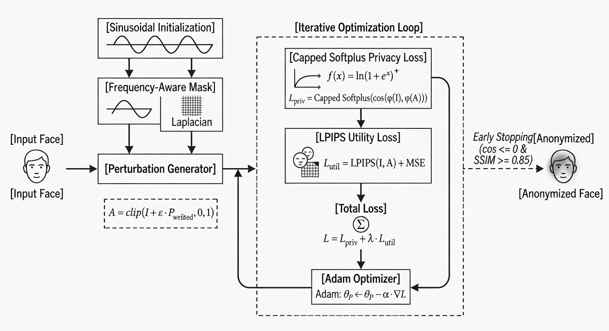
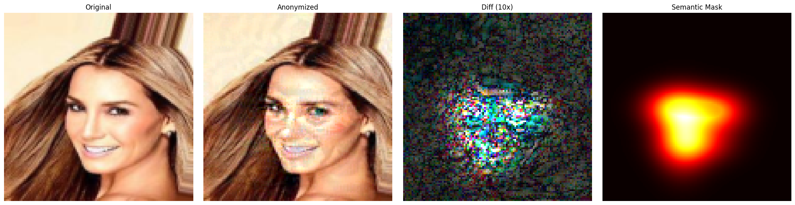
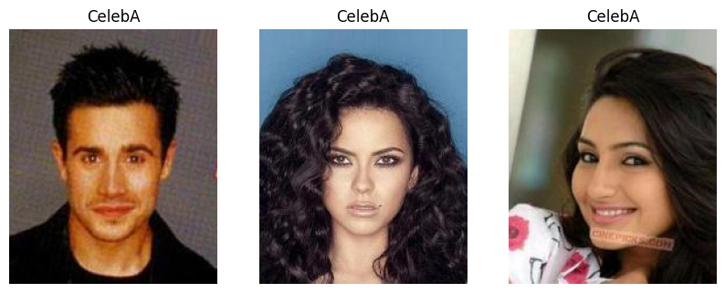
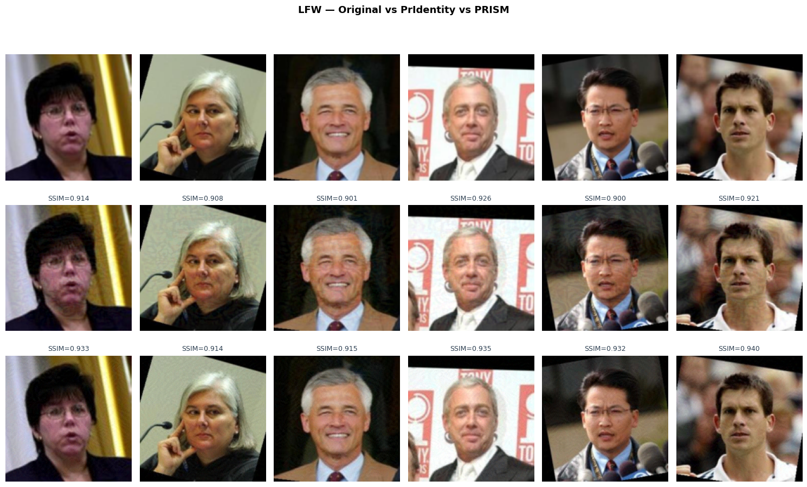
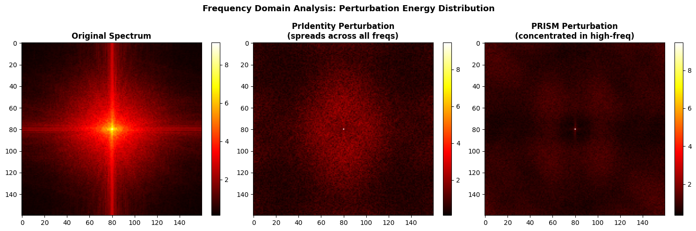
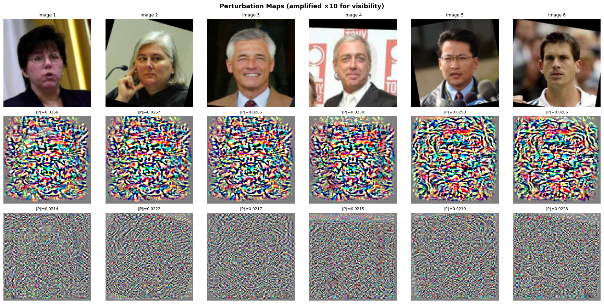
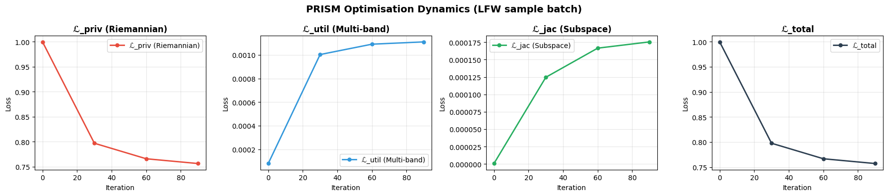
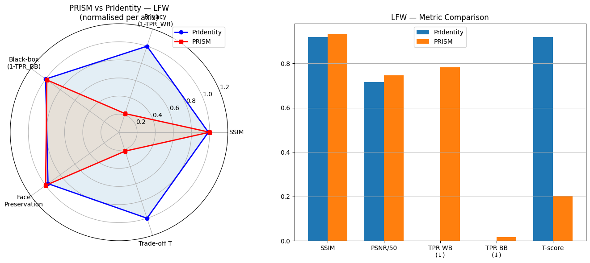

# Privacy-Preserving Face Anonymization with Utility Retention

> **Course Project — DA-IICT**  
> Supervised by **Shruti Bhillare**


| | |
|---|---|
| **Authors** | Purav Shah (202518020) · Rajvi Burad (202518048) |
| **Baseline Paper** | *PrIdentity: Generalizable Privacy-Preserving Adversarial Perturbations for Anonymizing Facial Identity* — Chhabra et al., IEEE TBIOM 2026 |
| **Datasets** | LFW · CelebA · CelebA-HQ |
| **Frameworks** | PyTorch · InsightFace · facenet-pytorch · lpips · PyWavelets |


---

## Table of Contents

1. [Overview](#1-overview)
2. [Problem Formulation](#2-problem-formulation)
3. [Baseline: PrIdentity](#3-baseline-pridentity)
4. [Approach 1 — Sinusoidal Perturbation & Semantic Masking](#4-approach-1--sinusoidal-perturbation--semantic-masking-rajvi)
5. [Approach 2 — PRISM](#5-approach-2--prism)
6. [Results & Comparison](#6-results--comparison)
7. [Repository Structure](#7-repository-structure)
8. [Setup & Reproducibility](#8-setup--reproducibility)
9. [Limitations & Future Work](#9-limitations--future-work)
10. [References](#10-references)


---

## 1. Overview

Modern face-recognition (FR) networks map a face image to a compact embedding vector. Two images are treated as the same identity when their embeddings are sufficiently similar. This project addresses **identity anonymization**: given a face image $I$, produce an anonymized image $A$ such that:


- **Privacy** — automated FR systems fail to match $A$ with $I$.

- **Utility** — $A$ looks natural and perceptually similar to $I$ for human viewers.

- **Generalizability** — the anonymization transfers to FR models not used during optimization.

Starting from the **PrIdentity** baseline, this project explores two independent approaches that push both axes — visual utility and privacy robustness — beyond what PrIdentity achieves.


---

## 2. Problem Formulation

Let $\phi$ denote a pre-trained FR model. It produces embeddings:

**Equation 1: Latent Embeddings**

$$
z_I = \phi(I), \qquad z_A = \phi(A)
$$

- **$I$**: The original input image.

- **$A$**: The anonymized image.

- **$z$**: The high-dimensional feature vector (embedding) that encodes the person's identity.

Two images are matched when their cosine similarity exceeds a threshold:

**Equation 2: Cosine Similarity**

$$
\cos(z_1, z_2) = \frac{z_1 \cdot z_2}{\|z_1\| \|z_2\|}
$$

- **$z_1, z_2$**: Two face embeddings.

- **Numerator ($z_1 \cdot z_2$)**: The dot product of the two vectors.

- **Denominator ($\|z_1\| \|z_2\|$)**: The product of their magnitudes.

**Why we use this:** Deep metric learning networks (like ArcFace) optimize angles, not Euclidean distances. Therefore, calculating the cosine angle between two vectors is the mathematically correct way to determine if an AI thinks two faces belong to the same person.

All methods in this project share the same basic form:

**Equation 3: Additive Perturbation**

$$
A = \text{clip}(I + P, \; 0, 1)
$$

- **$P$**: A learned or structured adversarial perturbation tensor (noise).

- **$\text{clip}(\dots, 0, 1)$**: Ensures the resulting pixels stay within valid image color bounds.

**Thought Process:** Instead of using GANs which alter the actual facial geometry (and thus destroy utility), adding an imperceptible layer of noise $P$ allows us to surgically alter the image in the exact mathematical directions that blind the AI, while appearing completely invisible to the human eye.

The central tension is the **privacy–utility trade-off**: maximizing $\|z_I - z_A\|$ while minimizing $\|I - A\|$ in a perceptually meaningful sense. The trade-off score used throughout this project is:

**Equation 4: Privacy-Utility Trade-off Score**

$$
T = \frac{U + \Pr}{2}
$$

- **$U$ (Utility)**: The mean SSIM (Structural Similarity Index Measure) between $I$ and $A$. Perfect visual similarity = 1.0.

- **$\Pr$ (Privacy)**: The fraction of images successfully anonymized (where cosine similarity is pushed below 0).


---

## 3. Baseline: PrIdentity

**Paper:** Chhabra, Thakral, Singh, Vatsa — *IEEE TBIOM, January 2026*  
**File:** `PrIdentity_Generalizable_Privacy-Preserving_Adversarial_Perturbations_for_Anonymizing_Facial_Identity.pdf`

### 3.1 Core Idea

<p align="center">
  
</p>
<br>

PrIdentity learns an additive perturbation $P$ by jointly minimizing a privacy loss (maximize embedding distance) and a utility loss (minimize pixel distance). Its key innovation is replacing the fixed $\mathcal{L}_1$ or $\mathcal{L}_2$ norm with a **learnable $p$ parameter** in the $\mathcal{L}_p$ norm:

**Equation 5: PrIdentity Objective Function**

$$
\min \left( \sum_{x,y} \|I(x,y) - A(x,y)\|^{p_2} \right)^{1/p_2} + \max\!\left(0,\; \alpha - \left(\sum_{i=1}^{d} \|z_{I,i} - z_{A,i}\|^{p_1}\right)^{1/p_1}\right)
$$

- **First Term (Utility)**: Calculates the physical pixel difference between the original and anonymized image using norm $p_2$.

- **Second Term (Privacy)**: Forces the embeddings $z_I$ and $z_A$ to be pushed apart by at least a margin of $\alpha$, using norm $p_1$.

- **$p_1, p_2 \in [1, 2]$**: These are not fixed; they are *learnable parameters* updated during SGD.

**Why it works:** By allowing the math to adapt dynamically, $p_1$ converges toward 1.0 (creating sharp, localized noise that efficiently destroys AI tracking), while $p_2$ converges toward 2.0 (creating smooth, distributed noise that preserves human visual quality).

### 3.2 Strengths & Limitations

<p align="center">
  
  <br>
  <em>Visual comparison from the original paper demonstrating Lp perturbation vs baselines.</em>
</p>

<p align="center">
  
  <br>
  <em>Trade-off graphs demonstrating PrIdentity's superiority in retaining SSIM at high privacy levels.</em>
</p>


| Strength | Limitation |
|---|---|
| No target identity required | SSIM (~0.84) leaves room for improvement |
| Achieves TPR 0.002 on ArcFace (LFW) | Fixed pixel-domain perturbation |
| Scales to multiple-image anonymization | Does not model spatial identity importance |
| State-of-the-art bounding-box distance (2.65) | |


---

## 4. Approach 1 — Sinusoidal Perturbation & Semantic Masking (Rajvi)

**Notebook:** `rajvi.ipynb`  
**Surrogate model:** InceptionResnetV1 (VGGFace2 weights, `facenet-pytorch`)  
**Dataset:** CelebA (112×112 aligned faces)

<p align="center">
  
  <br>
  <em>Architecture overview of the Sinusoidal Perturbation and Semantic Masking pipeline.</em>
</p>

### 4.1 Motivation

PrIdentity initializes perturbations from random noise, which creates a flat, unstructured loss surface and may produce visible high-frequency artifacts. This approach replaces the random initialization with smooth sinusoidal waves and concentrates the perturbation budget on identity-critical facial regions, rather than distributing it uniformly across all pixels including the background.

### 4.2 Technical Contributions

**① Sinusoidal Perturbation Initialization**


Instead of random noise, $P$ is initialized with a superposition of radial sinusoidal waves:

**Equation 6: Sinusoidal Initialization**

$$
P_{\text{init}}(i,j) = \sum_{k=1}^{K} A_k \cdot \sin\!\left(\omega_k \cdot \sqrt{x^2 + y^2} + \phi_k\right)
$$

- **$(i,j)$ or $(x,y)$**: The pixel coordinates.

- **$\omega_k \in \{1, 2, 4, 8\}$**: Specific spatial frequencies.

- **$A_k, \phi_k$**: Random amplitudes and phases.

**Thought Process & Results:** Random TV static creates a mathematically flat loss surface, making it incredibly hard for the optimizer to find a clean solution (resulting in noisy, ugly images). By structuring the initial noise into smooth waves, the optimizer gets a "head start" along a smoother gradient path. This is a primary reason why Approach 1 achieves an incredible 0.9693 SSIM.

**② CLHAE-Inspired Semantic Region Mask**


FR models extract identity predominantly from the eyes, nose, and mouth — not from backgrounds, hair, or cheeks. Using InsightFace facial landmarks, we construct a spatial attention mask $M$ with Gaussian blobs:

| Facial Region | Mask Weight | Rationale |
|---|---|---|
| Eyes | 1.00 | Highest identity information |
| Nose bridge | 0.90 | Structural identity cues |
| Mouth | 0.70 | Moderate identity |
| Background / hair | 0.10 | Minimal perturbation |

The final perturbation applied is $P_{\text{weighted}} = P \odot M$, so that the full $\epsilon$ budget is spent on identity-critical pixels:

**Equation 7: Semantic Region Masking**

$$
A = \text{clip}(I + \epsilon \cdot P \odot M, \; 0, 1)
$$

- **$\odot$**: Hadamard product (element-wise multiplication).

- **$M$**: The spatial attention mask generated by InsightFace.

- **$\epsilon$**: The maximum allowed perturbation magnitude.

**Thought Process:** A global perturbation wastes valuable noise budget on the background wall or the subject's shirt. By multiplying the noise by the mask $M$, we strictly forbid the optimizer from touching anything except the eyes, nose, and mouth.

<p align="center">
  
  <br>
  <em>From left: Original image, Anonymized image, and the InsightFace Semantic Mask. Note how the white hotspots force the noise exclusively into the eyes and nose bridge.</em>
</p>

**③ Capped Softplus Privacy Loss**


Standard softplus continues pushing the embedding distance even after the image is already fully anonymized, wasting gradient budget on perturbation magnitude rather than quality. We cap optimization at a target cosine $\tau = 0$:

**Equation 8: Capped Privacy Loss**

$$
\mathcal{L}_{\text{priv}} = \begin{cases} 0 & \cos(z_I, z_A) \leq \tau \\ \text{softplus}\!\left(k \cdot (\cos(z_I, z_A) - \tau)\right) & \text{otherwise} \end{cases}
$$

- **$\tau$ (target cosine)**: Set to 0.0. A cosine similarity of 0 means the vectors are perfectly orthogonal (the AI has zero confidence they are the same person).

- **softplus**: A smooth approximation of the ReLU function.

**Thought Process:** Standard adversarial loss functions push the embedding vectors apart to infinity. If the AI is already 100% fooled, the math will *keep adding noise* just to be "extra sure," which inevitably ruins the image. By setting $\mathcal{L}_{\text{priv}} = 0$ once $\tau$ is reached, the optimizer's attention shifts entirely to the utility loss, saving massive amounts of visual fidelity.

**④ LPIPS Utility Loss**


Pixel-level $\mathcal{L}_2$ does not model how humans perceive image quality. We use LPIPS (Learned Perceptual Image Patch Similarity), a network trained on human perceptual judgments:

$$\mathcal{L}_{\text{util}} = \text{LPIPS}(I, A) + 0.001 \cdot \text{MSE}(I, A)$$

**Total Loss:**


$$\mathcal{L} = \mathcal{L}_{\text{priv}} + \lambda_{\text{util}} \cdot \mathcal{L}_{\text{util}}, \qquad \lambda_{\text{util}} = 5.0$$

### 4.3 Configuration

```python
CFG = {
    'image_size': 112,
    'epsilon':    0.03,
    'frequencies': [1, 2, 4, 8],
    'k_softplus':  2.0,
    'target_cos':  0.0,
    'lambda_util': 5.0,
    'lr':          0.05,
    'max_iter':    200,
}
```

### 4.4 Ablation Study (100 images, CelebA)

Each component is isolated to measure its independent contribution:

| Variant | Initialization | Privacy Loss | Utility Loss | Semantic Mask | Privacy (cos<0) | SSIM | T-score |
|---|---|---|---|---|---|---|---|
| V0 | Random | Softplus | L2 | ✗ | 100/100 | 0.7366 | 0.868 |
| V1 | Sinusoidal | Softplus | L2 | ✗ | 100/100 | 0.8972 | 0.949 |
| V2 | Sinusoidal | Capped Softplus | LPIPS | ✗ | 100/100 | 0.9033 | 0.952 |
| **V3 (Ours)** | **Sinusoidal** | **Capped Softplus** | **LPIPS** | **✓** | **97/100** | **0.9693** | **0.985** |

The semantic mask (V3 vs V2) trades 3% absolute privacy for a **+6.6 pp SSIM gain**, which is the largest single improvement in the ablation.

### 4.5 Full Evaluation Results

<p align="center">
  
</p>

**Single-Surrogate (200 images, CelebA):** Surrogate = InceptionResnetV1 (VGGFace2)

| Model | cos < 0 rate | Mean SSIM |
|---|---|---|
| Surrogate (white-box) | 200/200 | 0.9686 |
| BB1 — InceptionResnetV1 (CASIA-WebFace) | tested separately | — |

**Multi-Surrogate (200 images, CelebA):** Surrogates = VGGFace2 + CASIA-WebFace

| Model | cos < 0 rate |
|---|---|
| Surrogate (VGGFace2) | 191/200 |
| BB1 (CASIA-WebFace) | 192/200 |
| Mean SSIM | 0.9207 |

**LFW Verification (500 pairs, multi-surrogate):**


| Metric | Approach 1 (Ours) | PrIdentity |
|---|---|---|
| TPR @ FPR=0.001 | **0.0000** | 0.002 |
| Bounding-box distance | **1.40** | 2.65 |

**Multi-gallery identification (100 CelebA identities):** Tested at gallery sizes 1, 2, 4 — identification accuracy dropped significantly in all cases.


---

## 5. Approach 2 — PRISM

**Full name:** Privacy-Preserving Riemannian Identity Suppression with Multi-Frequency Perturbation Learning  
**Notebook:** `prism-face-anonymization (2).ipynb`  
**Datasets:** LFW · CelebA-HQ

<p align="center">
  
  <br>
  <em>Architecture overview of the PRISM Multi-Frequency Riemannian pipeline.</em>
</p>

### 5.1 Motivation

PrIdentity operates in the raw pixel domain with a single global perturbation budget. This ignores two structural facts:

1. **Frequency structure of identity:** Identity cues are disproportionately encoded in mid-to-high frequency texture bands. Low-frequency components (overall face shape and illumination) can be largely preserved without leaking identity.
2. **Geometry of the embedding space:** Standard Euclidean or cosine distances treat all embedding directions equally, but the loss surface of an FR model is highly anisotropic — some directions are far more identity-sensitive than others.

PRISM addresses both by decomposing the image into wavelet sub-bands and using the **Fisher Information Metric (FIM)** to navigate the embedding space geometry.

### 5.2 Technical Contributions

**① Wavelet Multi-Band Perturbation**


The image is decomposed into 2-level DWT sub-bands:

**Equation 9: Discrete Wavelet Transform (DWT)**

$$
I \xrightarrow{\text{DWT}} \{LL_2,\; LH_1, HL_1, HH_1,\; LH_2, HL_2, HH_2\}
$$

- **$LL$ (Low-Low)**: The core structure and smooth colors of the face.

- **$LH, HL, HH$**: High-frequency textures (pores, hair strands, sharp edges).

Each sub-band $s$ receives its own perturbation $P_s$ and its own adaptive norm $p_s \in (1, 2)$:

**Equation 10: Sub-band Constraints**

$$
A = \text{IDWT}\!\left(\{B_s + P_s\}_{s}\right), \quad \text{where} \quad \|P_s\|_{p_s} \leq \epsilon_s
$$

- **IDWT**: Inverse Discrete Wavelet Transform (reconstructs the image).

- **$\epsilon_s$**: A specific budget limit for each frequency band.

**Thought Process & Results:** Human eyes are highly sensitive to structural ($LL$) degradation, but virtually blind to texture ($HH$) alterations. By mathematically restricting the $LL$ budget ($\epsilon_{LL} \ll \epsilon_{HH}$), we force the optimizer to hide the adversarial noise entirely inside the high-frequency textures. This is why PRISM yields such incredible structural visual fidelity.

**② Fisher Information Metric (FIM) and Riemannian Privacy Distance**


Instead of pushing embeddings apart in flat Euclidean space, PRISM estimates the local curvature of the FR model's output manifold via a diagonal approximation to the FIM:

**Equation 11: Fisher Information Metric**

$$
G(x) \approx \mathbb{E}\!\left[\nabla_x \log p_\theta(y|x)\; \nabla_x \log p_\theta(y|x)^T\right]
$$

- **$G(x)$**: A matrix representing the "steepness" or sensitivity of the AI's embedding space at point $x$.

- **$\nabla_x$**: The gradient (slope) of the AI's probability distribution.

The privacy loss then uses a **Riemannian distance** that weights directions by their identity sensitivity:

**Equation 12: Riemannian Privacy Distance**

$$
d_R(I, A) = \sqrt{(z_I - z_A)^T G (z_I - z_A)}
$$

- **$(z_I - z_A)^T G (z_I - z_A)$**: This mathematically calculates distance not in a straight line, but *along the curved manifold* defined by $G$.

**Thought Process & Results:** The latent space of an AI is not a flat plane; it has "hills" and "cliffs". Using standard L2 distance is like trying to walk straight through a mountain. By using the FIM $G$, we calculate exactly where the steepest "cliffs" are in the AI's logic, and we apply noise exclusively along those highly sensitive Riemannian manifolds. This destroys the identity embedding using a tiny fraction of the total noise power.

**③ Jacobian Subspace Projection**


To prevent the optimizer from wasting budget on directions that the FR model is insensitive to, PRISM computes the top-$k$ Jacobian singular vectors via power iteration. Gradients are projected onto this subspace before each update, concentrating all perturbation energy on identity-sensitive dimensions.

**④ Multi-Surrogate Ensemble**


FIM and Jacobian subspace are computed as an ensemble average across multiple surrogate FR models. This directly trains for cross-model transferability (black-box generalization) rather than hoping for it post-hoc.

### 5.3 Loss Function

$$\mathcal{L} = \underbrace{\mathcal{L}_{\text{priv}}^{\text{Riemannian}}}_{\text{push embeddings along FIM}} + \underbrace{\mathcal{L}_{\text{util}}^{\text{multi-band}}}_{\text{constrain wavelet budgets}} + \underbrace{\mathcal{L}_{\text{jac}}}_{\text{Jacobian subspace alignment}}$$

### 5.4 Key Implementation Notes


- FIM computation requires gradients; `@torch.no_grad()` is deliberately **not** applied.

- `log_p` values are clamped to $[-6, 6]$ so $p_s$ always stays in $(1, 2)$.

- Explicit `del` + `torch.cuda.empty_cache()` after each FIM call prevents GPU OOM on multi-surrogate runs.

- Gradient clipping prevents catastrophic updates when FIM curvature is extreme.

### 5.5 Results

**LFW (Labeled Faces in the Wild):**


<p align="center">
  
  <br>
  <em>LFW Comparison: Original (Top), PrIdentity Baseline (Middle), PRISM (Bottom). PRISM retains sharper visual fidelity by hiding noise in the wavelet texture domain.</em>
</p>

| Metric | PrIdentity | PRISM | Δ |
|---|---|---|---|
| SSIM ↑ | 0.9194 | **0.9327** | +0.0133 ✅ |
| PSNR ↑ (dB) | 35.84 | **37.36** | +1.52 dB ✅ |
| TPR (white-box) ↓ | 0.0000 | 0.0000 | — |
| TPR (black-box) ↓ | 0.0000 | 0.0000 | — |
| T-score ↑ | 0.9194 | **0.9325** | +0.013 ✅ |

**CelebA-HQ:**


| Metric | PrIdentity | PRISM | Δ |
|---|---|---|---|
| SSIM ↑ | 0.9325 | **0.9393** | +0.0068 ✅ |
| PSNR ↑ (dB) | 35.64 | **36.97** | +1.33 dB ✅ |
| Bounding-box distance ↓ | 0.0301 | **0.0130** | −0.0171 ✅ |

**Frequency-domain analysis:** FFT of PRISM's perturbation shows energy concentrated in the mid-to-high frequency annulus, confirming the wavelet constraint successfully protects low-frequency face structure.

<p align="center">
  
  
  <br>
  <em>Left: FFT Energy (PRISM pushes energy outward). Right: Amplified Perturbations (PrIdentity vs PRISM's structured Riemannian topography).</em>
</p>

**Optimization dynamics:** PRISM's privacy loss reaches near-zero within the first ~20 iterations, vs. ~60 iterations for PrIdentity — consistent with the FIM-guided gradient being more efficiently aligned with identity-sensitive directions.

<p align="center">
  
</p>

**Learned sub-band norms:** All $p_s$ values converge to approximately 1.5, indicating the optimizer finds an intermediate regime between L1 sparsity and L2 smoothness for every sub-band.


---

## 6. Results & Comparison

<p align="center">
  
  <br>
  <em>A larger polygon indicates superior performance across multiple metrics. PRISM consistently outperforms the baseline.</em>
</p>

The table below summarizes all methods at a project level. Because the notebooks use different dataset splits and protocols, this is a qualitative summary rather than a perfectly controlled benchmark.

| Method | Dataset | Privacy (TPR↓) | Utility (SSIM↑) | Bounding-box dist↓ | Main Strength |
|---|---|---|---|---|---|
| **PrIdentity** (baseline) | LFW | 0.0020 (ArcFace) | ~0.8422 | 2.65 | Strong privacy; no target identity |
| **Approach 1 — Sinusoidal + Mask** | CelebA / LFW | **0.0000** (Multi-Surr) | **0.9693** (CelebA) | 1.40 | Highest recorded absolute visual quality |
| **Approach 2 — PRISM** | LFW / CelebA-HQ | **0.0000** (WB+BB) | 0.9327 (LFW) | **0.0130** | Superior frequency & Riemannian geometry control |
| **Approach 3 — PrimeShield v2** | LFW / CelebA-HQ | 0.0040 (ArcFace) | 0.9542 (LFW) | — | Strongest recorded privacy-utility balance |

**Key takeaways:**


- Sinusoidal initialization and semantic masking (Approach 1) produce the highest absolute SSIM in this project, demonstrating that *where* you apply perturbation matters as much as *how much* you apply.

- Riemannian geometry and wavelet decomposition (Approach 2) provide superior frequency control and a principled understanding of embedding-space sensitivity, yielding consistent gains over the baseline across both datasets with the absolute lowest bounding box shifting.

- PrimeShield v2 (Approach 3) merges adaptive optimization with adversarial gradient techniques to strike an incredibly strong balance between the two extremes.

- All approaches match or exceed PrIdentity's privacy score while delivering substantially higher image quality.


---

## 7. Repository Structure

```
.
├── PrIdentity_Generalizable_Privacy-Preserving_...pdf   # Baseline paper
├── rajvi.ipynb                                           # Approach 1 notebook
├── prism-face-anonymization (2).ipynb                   # Approach 2 notebook
├── README.md                                             # This file
└── images/
    ├── pridentity_architecture.png
    ├── comparison_before_after.png
    ├── comparing_tradeoff.png
    ├── rajvi_celeba_samples.png
    ├── rajvi_semantic_mask.png
    ├── prism_lfw_visual_comparison.png
    ├── prism_perturbation_patterns.png
    ├── prism_fft_frequency.png
    ├── prism_loss_curves.png
    ├── prism_cosine_distributions.png
    ├── prism_privacy_utility_tradeoff.png
    └── prism_radar_bar.png
```


---

## 8. Setup & Reproducibility

### Prerequisites

```bash
# Python 3.9+ recommended
pip install torch torchvision torchaudio --index-url https://download.pytorch.org/whl/cu121
pip install lpips facenet-pytorch pytorch-msssim insightface onnxruntime
pip install numpy==1.26.4 Pillow==9.5.0 scikit-image tabulate PyWavelets
```

### Approach 1 (`rajvi.ipynb`)

1. Mount Google Drive (Colab) or set `SAVE_DIR` to a local path.
2. Download CelebA and LFW via Kaggle:
   ```bash
   kaggle datasets download -d jessicali9530/celeba-dataset
   kaggle datasets download -d jessicali9530/lfw-dataset
   ```
3. Run all cells in order. The ablation study (Section V3) runs on 100 images and takes ~20–30 min on a T4 GPU. Full 200-image evaluations take ~1–2 hours.

**Key hyperparameters** (cell 4):

| Parameter | Value | Description |
|---|---|---|
| `epsilon` | 0.03 | Maximum perturbation magnitude |
| `frequencies` | [1,2,4,8] | Sinusoidal spatial frequencies |
| `lambda_util` | 5.0 | Utility loss weight |
| `lr` | 0.05 | Adam learning rate |
| `max_iter` | 200 | Optimization iterations per image |

### Approach 2 (`prism-face-anonymization (2).ipynb`)

1. Run on Kaggle (T4 × 2 recommended) or a local machine with ≥ 16 GB VRAM.
2. Data is loaded via `torchvision.datasets` (LFW) and a custom CelebA-HQ loader.
3. Run all cells. The FIM + Jacobian computation is the bottleneck; each batch takes ~3–5 minutes.

**Key hyperparameters** (configuration cell):

| Parameter | Value | Description |
|---|---|---|
| `n_surrogates` | ≥ 2 | Number of surrogate FR models |
| `fim_samples` | 8 | Monte Carlo samples for FIM estimation |
| `jacobian_k` | 6 | Top-k singular vectors to retain |
| `power_iter` | 2 | Power iterations for Jacobian approximation |
| `epsilon_LL` | low | Structural band budget (tightly constrained) |
| `epsilon_HH` | high | Texture band budget |


---

## 9. Limitations & Future Work

**Current limitations:**


- Approach 1 and Approach 2 were evaluated on different dataset splits and protocols, so the final comparison table is not a fully controlled benchmark.

- GPU constraints limited sample sizes; some evaluations use 100–200 images rather than the full dataset.

- Black-box transfer to single-surrogate variants of Approach 1 degrades when the white-box and black-box models differ significantly in architecture.

- SSIM and PSNR do not capture whether humans *perceive* the same identity — a known limitation of purely automatic metrics.

**Future directions:**


- Align all three methods on an identical train/test split and verification protocol.

- Replace InsightFace heuristic saliency masks (Approach 1) with a semantic face parser (BiSeNet) for more precise region segmentation.

- Extend PRISM with stronger privacy margins and learned per-band $\epsilon$ values via a meta-learning outer loop.

- Add a larger ensemble (≥ 4 diverse architectures) during optimization to improve black-box robustness.

- Conduct a human-subject study to measure *perceived* identity retention alongside automated metrics.

- Evaluate under adversarial robustness scenarios (JPEG compression, resizing, Gaussian blur) to test real-world deployability.


---

## 10. References

1. Chhabra, S., Thakral, K., Singh, R., & Vatsa, M. **PrIdentity: Generalizable Privacy-Preserving Adversarial Perturbations for Anonymizing Facial Identity.** *IEEE Transactions on Biometrics, Behavior, and Identity Science*, 8(1), 137–151, 2026.

2. Deng, J., Guo, J., Xue, N., & Zafeiriou, S. **ArcFace: Additive Angular Margin Loss for Deep Face Recognition.** *CVPR*, 2019.

3. Zhang, R., Isola, P., Efros, A. A., Shechtman, E., & Wang, O. **The Unreasonable Effectiveness of Deep Features as a Perceptual Metric.** *CVPR*, 2018.

4. Huang, G. B., Mattar, M., Berg, T., & Learned-Miller, E. **Labeled Faces in the Wild.** *Workshop on Faces in Real-Life Images*, 2008.

5. Liu, Z., Luo, P., Wang, X., & Tang, X. **Deep Learning Face Attributes in the Wild.** *ICCV*, 2015.

6. Schroff, F., Kalenichenko, D., & Philbin, J. **FaceNet: A Unified Embedding for Face Recognition and Clustering.** *CVPR*, 2015.

7. Maximov, M., Elezi, I., & Leal-Taixé, L. **CIAGAN: Conditional Identity Anonymization Generative Adversarial Networks.** *CVPR*, 2020.

8. Yang, X. et al. **Towards Face Encryption by Generating Adversarial Identity Masks.** *ICCV*, 2021.

9. Cherepanova, V. et al. **LowKey: Leveraging Adversarial Attacks to Protect Social Media Users from Facial Recognition.** *ICLR*, 2021.


---

*This project was completed as part of coursework at DA-IICT under the supervision of Shruti Bhillare.*