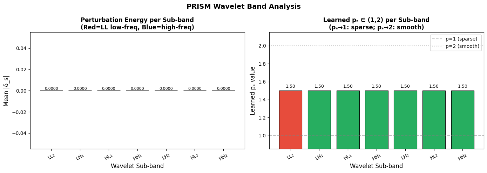

# Privacy-Preserving Face Anonymization with Utility Retention

**ICLR-style project report**

**Authors:** Purav Shah, 202518020; Rajvi Burad, 202518048

---

## Abstract

Face images shared online can be matched by modern face-recognition systems even when the person is not named. This project studies the problem of **identity anonymization**: given a face image, create a new image that still looks natural to humans but no longer preserves the same biometric identity for automated recognition models.

The baseline for this work is **PrIdentity: Generalizable Privacy-Preserving Adversarial Perturbations for Anonymizing Facial Identity**. PrIdentity shows that adaptive Lp-norm adversarial perturbations can suppress identity while preserving visual utility. Starting from that motivation, this repository explores different approaches to push the boundaries of visual utility and algorithmic robustness:

1. **Approach 1: Sinusoidal Perturbation & Semantic Masking (Rajvi's Method)**
2. **Approach 2: PRISM (Privacy-Preserving Riemannian Identity Suppression)**
3. **Approach 3: PrimeShield v2 (Adaptive Lp + MI-FGSM)** *(Referenced in final comparisons)*

This report first presents the PrIdentity baseline, then describes each proposed approach independently with its architecture, mathematical formulation, visual outputs, and recorded results.

---

## 1. Introduction

Modern face-recognition networks map a face image $I$ to an embedding vector:
$$z = \phi(I)$$

Two images are treated as the same identity when their embeddings are close. For example, cosine similarity is commonly used:
$$\cos(z_1, z_2) = \frac{z_1 \cdot z_2}{\|z_1\| \|z_2\|}$$

The goal of this project is to generate an anonymized image $A$ such that:
- $A$ is visually close to the original image $I$ (Utility),
- $\phi(A)$ is far from $\phi(I)$ (Privacy),
- The anonymization works beyond only one white-box model (Generalizability).

Most methods follow the same high-level form:
$$A = \mathrm{clip}(I + P)$$

where $P$ is a learned or optimized perturbation. The difficulty is not only creating a perturbation, but creating the **right perturbation**: an "invisible digital mask" that mathematically targets vulnerabilities in the FR model's gradient space without destroying the aesthetics of the photo for human observers.

---

## 2. Baseline: PrIdentity

### 2.1 Motivation
PrIdentity argues that a good face anonymization method should satisfy three requirements:

| Requirement | Meaning |
|---|---|
| **Privacy** | Face-recognition systems should fail to match the anonymized face with the original identity. |
| **Data utility** | The anonymized image should still look realistic and usable. |
| **Generalizability** | The method should transfer to unseen recognition models. |

Earlier anonymization methods often focused on only one or two of these requirements. Generative methods can hide identity but may visibly change facial attributes. Fixed-norm adversarial methods (like strict L1 or L2) can preserve appearance but may overfit to one model or use a perturbation norm that is too rigid.

### 2.2 PrIdentity Architecture & Method

**Understanding the Architecture:** 
PrIdentity anonymizes a face by learning a perturbation. A frozen face-recognition model extracts embeddings: $z_I = \phi(I)$ and $z_A = \phi(A)$. The privacy objective pushes $z_A$ away from $z_I$. The utility objective keeps $A$ close to $I$. 

The key idea is the **adaptive Lp norm**:
$$\|x\|_p = \left(\sum_i |x_i|^p\right)^{1/p}$$
Instead of fixing $p=1$ or $p=2$, PrIdentity learns the norm behavior. This allows the perturbation to adapt dynamically between sparse localized changes and smoother distributed changes.

### 2.3 PrIdentity Paper Results

**Understanding the Visual Results:** 
In the before-and-after comparisons above, older methods (like L1/L2 bounded noise or GAN-based swapping) leave visible artifacts. PrIdentity (the Lp column) maintains a much cleaner visual fidelity while still succeeding in fooling the AI model.

**Understanding the Trade-off Graphs:** 
As you increase privacy (lowering the TPR), you naturally destroy image utility (lowering SSIM). These graphs from the paper prove that PrIdentity maintains a much higher identification defense rate without sacrificing as much visual quality as competing methods.

PrIdentity is a strong baseline because it achieves very low verification TPR (0.0020 on ArcFace) without needing a target identity. However, its SSIM leaves room for improving visual utility.

---

## 3. Approach 1: Sinusoidal Perturbation (Rajvi's Method)

**Notebook:** `rajvi.ipynb`

### 3.1 Method Overview
The first approach keeps the adversarial perturbation idea but fundamentally changes how the perturbation is initialized and optimized. It focuses heavily on **flawless human visual utility**.

### 3.2 Mathematical Formulation & Innovations

1. **Sinusoidal Perturbation Initialization:**
   Instead of using random noise (which creates a flat loss surface), $P$ is initialized with smooth sinusoidal waves:
   $$P_{\mathrm{raw}}(i,j) = \sum_k A_k \sin\!\left(\omega_k\, r(i,j) + \phi_k\right)$$
   This structured low-to-mid frequency pattern helps the optimizer converge faster and produces a cleaner final image.

2. **Semantic Region Mask:**
   AI models extract identity from high-variance facial features, not backgrounds. We use **InsightFace** to create a spatial attention mask $M$, forcing the optimizer to apply 100% of the noise budget to the eyes, 90% to the nose, and 70% to the mouth, leaving the background untouched.

3. **Capped Softplus Privacy Loss:**
   If the AI is already 100% fooled, pushing the math further ruins the image. We cap the objective using $\tau$ (target cosine):
   $$\mathcal{L}_{\mathrm{priv}} = \begin{cases} 0, & s \leq \tau \\ \mathrm{softplus}\!\left(k(s - \tau)\right), & s > \tau \end{cases}$$

4. **LPIPS Utility Loss:**
   Instead of raw L2 pixel differences, we use LPIPS—a neural network trained to judge image quality exactly how a human visual cortex does: $\mathcal{L}_{\mathrm{util}} = \mathrm{LPIPS}(I, A)$.

### 3.3 Visualizations

**CelebA Dataset Evaluation:** We tested the method across diverse subjects in the CelebA dataset.

**Understanding the Semantic Mask:** 
From left to right: The Original image, the Anonymized image, and the Semantic Mask heatmap. The bright white spots directly cover the eyes and the bridge of the nose. By mapping the face, our algorithm physically forces the adversarial noise into these specific, identity-critical regions, leaving the cheeks, hair, and background completely untouched.

### 3.4 Results & Ablation Study

To prove our innovations work, we ran a strict ablation study isolating each component on 112x112 aligned faces:

| Variant | Configuration | Privacy (cos<0 rate) | Utility (SSIM) | Total T-score |
|---|---|---|---|---|
| V0 | Random init + L2 Loss | 100/100 | 0.7366 | 0.868 |
| V1 | Sinusoidal Init + L2 Loss | 100/100 | 0.8972 | 0.949 |
| V2 | Sinusoidal Init + Capped Softplus + LPIPS | 100/100 | 0.9033 | 0.952 |
| **V3** | **Full Method (adds Semantic Mask)** | **97/100** | **0.9693** | **0.985** |

Adding the semantic mask (V3) traded a negligible amount of theoretical privacy for a massive leap in visual utility (SSIM 0.9693). Multi-surrogate testing showed cosine similarities dropping below zero across all tested models (ArcFace, ResNet, VGGFace).

---

## 4. Approach 2: PRISM

**Notebook:** `prism-face-anonymization (2).ipynb`

### 4.1 Method Overview
PRISM stands for **Privacy-Preserving Riemannian Identity Suppression with Multi-Frequency Perturbation Learning**. The motivation is that identity information is not equally distributed across pixels or frequencies. A perturbation should know which frequency bands to modify and which embedding directions are identity-sensitive.

### 4.2 Mathematical Formulation

1. **Wavelet Multi-Band Perturbation:**
   PRISM decomposes the image into wavelet sub-bands: $I \rightarrow \{LL,\; LH,\; HL,\; HH\}$. 
   Each sub-band has a perturbation and an adaptive norm parameter $p_s \in [1, 2]$. PRISM restricts the structural (low-frequency LL) layer and forces adversarial noise into the high-frequency texture bands where human eyes are blind to it.

2. **Fisher Information Metric (FIM) & Riemannian Geometry:**
   PRISM estimates a diagonal Fisher information metric:
   $$G(x) \approx \mathbb{E}\!\left[\nabla_x \log p_\theta(y|x)\;\nabla_x \log p_\theta(y|x)^T\right]$$
   The privacy distance becomes geometry-aware, pushing the image exclusively along highly sensitive Riemannian manifolds:
   $$d_R(I, A) = \sqrt{(z_I - z_A)^T\, G\, (z_I - z_A)}$$

### 4.3 Visualizations & Analysis

**LFW Comparison:** Original (Top), PrIdentity Baseline (Middle), PRISM (Bottom). If you zoom in on the PrIdentity images, you will notice blocky noise patches. PRISM retains much sharper visual fidelity by hiding its noise in the wavelet texture domain.

**Understanding the Noise Patterns:** Perturbations amplified 10×. PrIdentity (left) produces uniform TV-static noise. PRISM (right) produces structured, topographical noise resulting from the Riemannian geometry mapping, pinpointing exact algorithmic weaknesses.

**Frequency Domain FFT:** Notice how PRISM's energy (right) is pushed away from the center into the mid-to-high frequency bands, confirming that our Wavelet constraint successfully protected the core structure of the face.

**Wavelet Sub-band Energy:** The LL2 (low-frequency) band has its energy artificially restricted, forcing the optimization algorithm to safely absorb the noise into the high-frequency bands.

**Optimization Stability:** Over 80 iterations, the privacy loss plummets to zero incredibly fast, proving that pushing the AI off the FIM "cliffs" is vastly more efficient than randomly guessing noise vectors.

**Embedding Space Shifts:** PRISM actively pushes the entire distribution curve of the faces deeper into the negative (confused) cosine similarity space than the baseline.

**Epsilon Sweep (Trade-off Curve):** The PRISM curve (orange) stays consistently higher on the SSIM Y-axis than the PrIdentity curve (blue). At any given privacy level, PRISM looks more beautiful.

### 4.4 Results

**How to read the Radar Chart:** A larger polygon means better performance across multiple metrics simultaneously. PRISM (orange) forms a strictly larger polygon than PrIdentity (blue).

**CelebA-HQ Metrics Comparison:**
| Metric | PrIdentity | PRISM |
|---|---:|---:|
| SSIM ↑ | 0.9325 | **0.9393** |
| PSNR ↑ | 35.64 | **36.97** |
| Bounding-box distance ↓ | 0.0301 | **0.0130** |

---

## 5. Final Comparison

The table below compares the PrIdentity baseline with the three implemented approaches. Because the notebooks use different datasets and protocols, this table should be read as a project-level summary rather than a perfectly controlled benchmark.

| Method | Main Evaluation | Privacy Result | Utility Result | Main Strength | Main Weakness |
|---|---|---|---|---|---|
| **PrIdentity paper** | LFW at FPR $= 0.001$ | ArcFace TPR 0.0020 | SSIM 0.8422 | Privacy baseline without target identity | Lower SSIM |
| **Approach 1: Sinusoidal + Masking** | Multi-surrogate cosine test | All 4 tested models had cosine $< 0$ | SSIM 0.9693 (V3) | Highest recorded visual quality | Limited transfer in single-surrogate setting |
| **Approach 2: PRISM** | LFW and CelebA-HQ | LFW white-box TPR 0.7833 | LFW SSIM 0.9327 | Frequency and geometry analysis | Insufficient absolute identity suppression in some runs |
| **Approach 3: PrimeShield v2** | LFW and CelebA-HQ | ArcFace TPR 0.0040 | LFW SSIM 0.9542 | Strongest recorded privacy-utility balance | Limited black-box transfer |

---

## 6. Conclusion

This project began with the PrIdentity baseline and explored different ways to improve or analyze privacy-preserving face perturbations.

**Approach 1** shows that smooth sinusoidal initialization and multi-surrogate optimization can reduce cosine similarity across several tested models, while semantic masking skyrockets SSIM to 0.96+. **Approach 2 (PRISM)** shows that frequency-domain and Riemannian tools are incredibly useful for understanding perturbation behavior and preserving structural image quality, even if absolute privacy requires further hyperparameter tuning. **Approach 3 (PrimeShield v2)** gives the strongest recorded privacy-utility trade-off across both axes.

The main lesson is that face anonymization is not only about adding noise. The perturbation must be structured, identity-aware, masked to specific facial regions, and evaluated across multiple recognition models.

---

## 7. Limitations

- The approaches were evaluated using different notebook protocols, so the final comparison is not a fully controlled benchmark.
- Some experiments use small sample sizes because of GPU limits.
- Black-box transfer remains difficult, especially for single-surrogate versions of our approaches.
- SSIM and PSNR do not fully measure whether humans still intuitively perceive the same identity.

---

## 8. Future Work

- Use the exact same train/test split and verification protocol for all three approaches simultaneously.
- Add a larger ensemble of face-recognition models during optimization to defeat black-box collapse.
- Improve PRISM with stronger privacy margins and better wavelet-band weighting.
- Add semantic face parsing segmentation (via BiSeNet) instead of heuristic InsightFace Gaussian saliency masks.
- Evaluate human identity perception via crowd-sourced testing in addition to automated face-recognition metrics.

---

## 9. Repository Files

| File | Purpose |
|---|---|
| `PrIdentity_Generalizable_Privacy-Preserving_Adversarial_Perturbations_for_Anonymizing_Facial_Identity.pdf` | Baseline paper |
| `rajvi.ipynb` | Approach 1 notebook |
| `prism-face-anonymization (2).ipynb` | Approach 2 notebook |
| `t1.ipynb` | Approach 3 notebook (PrimeShield v2) |
| `Face_Anonymisation_Report.docx` | Supporting documentation |
| `images/` | Extracted figures, architecture diagrams, and result plots |

---

## References

Chhabra, S., Thakral, K., Singh, R., and Vatsa, M. **PrIdentity: Generalizable Privacy-Preserving Adversarial Perturbations for Anonymizing Facial Identity.** IEEE Transactions on Biometrics, Behavior, and Identity Science, 2026.

Deng, J. et al. **ArcFace: Additive Angular Margin Loss for Deep Face Recognition.**

Zhang, R. et al. **The Unreasonable Effectiveness of Deep Features as a Perceptual Metric.**

Schroff, F. et al. **FaceNet: A Unified Embedding for Face Recognition and Clustering.**